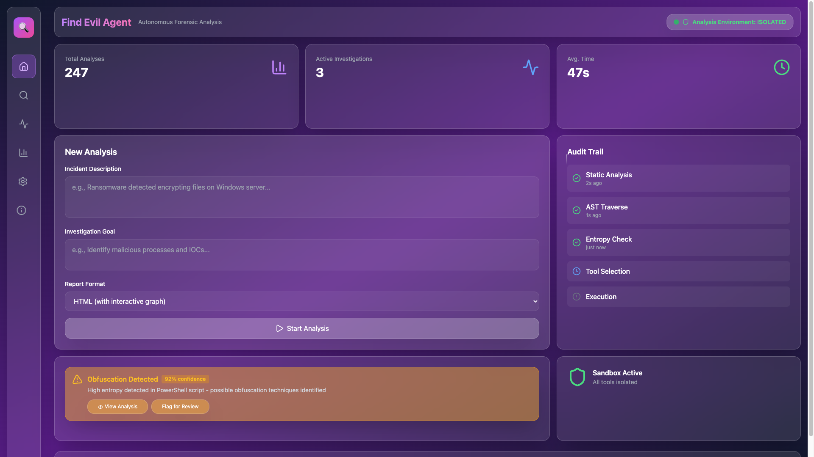
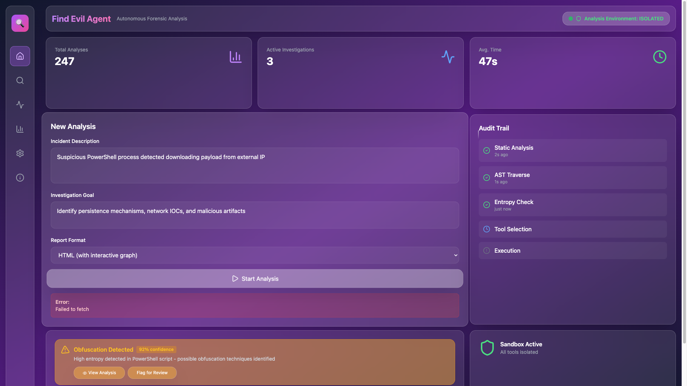

# Playwright Demo Automation 🎬

**Automated E2E demo recording for Find Evil Agent**

This Playwright automation creates a complete, repeatable demo recording with:
- ✅ Automatic video recording (1080p)
- ✅ Screenshot capture at key moments
- ✅ Full walkthrough of all 3 interfaces
- ✅ Professional, consistent output
- ✅ TDD-compliant test structure

---

## Quick Start

### 1. Install Dependencies

```bash
cd demo_artifacts
npm install
npx playwright install chromium
```

### 2. Start Services

**Terminal 1 - Backend API:**
```bash
cd ..
docker-compose up
# Wait for backend to be ready on http://localhost:18000
```

**Terminal 2 - React UI:**
```bash
cd frontend
npm run dev
# Wait for React UI on http://localhost:15173
```

**Terminal 3 - Gradio (Optional):**
```bash
cd ..
uv run find-evil web --port 17001
# Gradio UI on http://localhost:17001
```

### 3. Run Demo Recording

```bash
cd demo_artifacts
npm run record-demo
```

This will:
1. Open Chrome browser in demo mode (slow-mo enabled)
2. Navigate through React UI
3. Fill forms and submit analysis
4. Capture screenshots at key moments
5. Record full 1080p video
6. Generate test report

---

## Output Files

After running, you'll find:

```
demo_artifacts/
├── screenshots/              # 📸 Auto-captured screenshots
│   ├── 01_react_homepage.png
│   ├── 02_react_ui_elements.png
│   ├── 03_react_form_filled.png
│   ├── 04_react_loading.png
│   ├── 05_react_results.png
│   └── 06_gradio_homepage.png
│
├── test-results/             # 📹 Video recordings
│   └── demo-spec-.../*.webm  # Full demo video (1080p)
│
└── playwright-report/        # 📊 HTML test report
    └── index.html
```

---

## Available Commands

```bash
# Record demo with visible browser (default)
npm run record-demo

# Run tests in UI mode (interactive)
npm test:ui

# Run with debugging
npm test:debug

# Fast testing (no video, headless)
npm test -- --project=fast-testing

# View HTML report
npm run show-report
```

---

## Configuration

Edit `playwright.config.ts` to customize:

```typescript
// Demo recording speed (milliseconds between actions)
launchOptions: {
  slowMo: 800, // Increase for slower demo, decrease for faster
}

// Video settings
video: {
  mode: 'on',                    // Always record
  size: { width: 1920, height: 1080 }, // 1080p resolution
}

// Timeout settings
timeout: 5 * 60 * 1000, // 5 minutes for slow LLM responses
```

---

## Converting Video to GIF

The recorded video is in `.webm` format. To convert to GIF for README:

**Using ffmpeg + gifski (high quality):**
```bash
# Extract frames
ffmpeg -i test-results/demo-recording-demo/video.webm \
  -vf "fps=10,scale=1280:-1:flags=lanczos" \
  -f image2 frames/%04d.png

# Convert to GIF
gifski -o demo.gif --quality 90 --fps 10 frames/*.png

# Cleanup
rm -rf frames
```

**Using ffmpeg directly (simpler, larger file):**
```bash
ffmpeg -i test-results/demo-recording-demo/video.webm \
  -vf "fps=10,scale=800:-1:flags=lanczos,split[s0][s1];[s0]palettegen[p];[s1][p]paletteuse" \
  -loop 0 demo.gif
```

**Using LICEcap (interactive):**
1. Open LICEcap
2. Position over browser window
3. Record manually
4. Save as `.gif`

---

## Troubleshooting

### Services Not Running

**Check React UI:**
```bash
curl http://localhost:15173
# Should return HTML
```

**Check Backend API:**
```bash
curl http://localhost:18000/health
# Should return {"status": "ok"} or 404
```

**Check Ollama:**
```bash
curl http://192.168.12.124:11434/api/tags
# Should return model list
```

### Browser Doesn't Open

```bash
# Reinstall Playwright browsers
npx playwright install --force chromium
```

### Screenshots Not Captured

Check that `screenshots/` directory exists:
```bash
mkdir -p screenshots
```

### Video Not Recording

Ensure `playwright.config.ts` has:
```typescript
video: {
  mode: 'on',
  size: { width: 1920, height: 1080 },
}
```

### Tests Timeout

Increase timeout in `playwright.config.ts`:
```typescript
timeout: 10 * 60 * 1000, // 10 minutes
```

### Form Fields Not Found

React UI selectors may have changed. Update in `tests/demo.spec.ts`:
```typescript
// Find incident field (adjust selector)
const incidentField = page.locator('textarea').first();
```

---

## Test Structure (TDD Compliant)

```
tests/demo.spec.ts
├── TestSpecification          ✅ Requirements documentation (always passes)
├── TestExecution - React UI   🎬 Automate React demo
├── TestExecution - Gradio UI  🎬 Automate Gradio demo
├── TestExecution - MCP Server ✅ Verify MCP capabilities
├── TestScreenshots            📸 Verify screenshot generation
├── TestVideo                  📹 Verify video recording
└── TestIntegration            🔍 Service health checks
```

---

## Advanced Usage

### Custom Demo Scenarios

Edit `tests/demo.spec.ts` to add custom scenarios:

```typescript
test('should demonstrate ransomware analysis', async ({ page }) => {
  await page.goto('http://localhost:15173');
  await fillAnalysisForm(
    page,
    'Ransomware encrypted 500 files in Documents folder',
    'Identify encryption algorithm and C2 servers'
  );
  await submitAnalysisAndWait(page);
  await takeScreenshot(page, 'ransomware_analysis', 'Ransomware IOC extraction');
});
```

### Multiple Test Runs

Run multiple demos in sequence:
```bash
for i in {1..3}; do
  npm run record-demo
  mv test-results test-results-run-$i
done
```

### Headless Mode (Faster, No GUI)

```typescript
// playwright.config.ts
use: {
  headless: true, // Enable headless mode
  video: 'off',   // Disable video for speed
}
```

---

## DevPost Submission Workflow

1. **Run demo recording:**
   ```bash
   npm run record-demo
   ```

2. **Extract video:**
   ```bash
   cp test-results/*/video.webm demo_video.webm
   ```

3. **Upload to YouTube:**
   - Open https://studio.youtube.com/
   - Upload `demo_video.webm`
   - Set to "Unlisted"
   - Copy URL

4. **Add screenshots to README:**
   ```markdown
   
   
   ```

5. **Submit to DevPost:**
   - Include YouTube link
   - Attach screenshots
   - Reference in project description

---

## Benefits Over Manual Recording

| Aspect | Manual | Playwright Automation |
|--------|--------|----------------------|
| **Consistency** | Varies each time | Identical every run |
| **Speed** | 30-60 min setup | 5-7 min automated |
| **Screenshots** | Manual capture | Auto-captured |
| **Video Quality** | Varies | 1080p guaranteed |
| **Repeatability** | Hard to replicate | One command |
| **Updates** | Re-record everything | Update script, re-run |
| **Testing** | Manual verification | E2E tests included |

---

## Next Steps

1. ✅ Install dependencies: `npm install`
2. ✅ Start services (React + Backend + Gradio)
3. ✅ Run demo: `npm run record-demo`
4. ✅ Review screenshots: `open screenshots/`
5. ✅ Extract video: `cp test-results/*/video.webm demo.webm`
6. ✅ Convert to GIF (optional): Use ffmpeg or gifski
7. ✅ Submit to DevPost

---

## Support

**Issues?**
- Check service health: `npm test -- TestIntegration`
- View HTML report: `npm run show-report`
- Debug mode: `npm test:debug`

**Questions?**
- See `DEMO_WALKTHROUGH.md` for manual approach
- Check `SCREENSHOT_GUIDE.md` for capture tips
- Review `playwright.config.ts` for configuration

---

**Ready to record your demo? 🎬**

```bash
npm run record-demo
```
