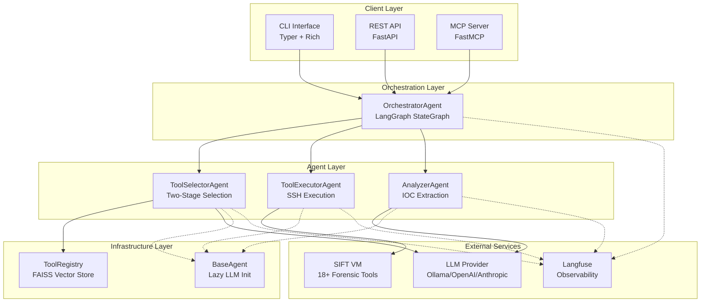
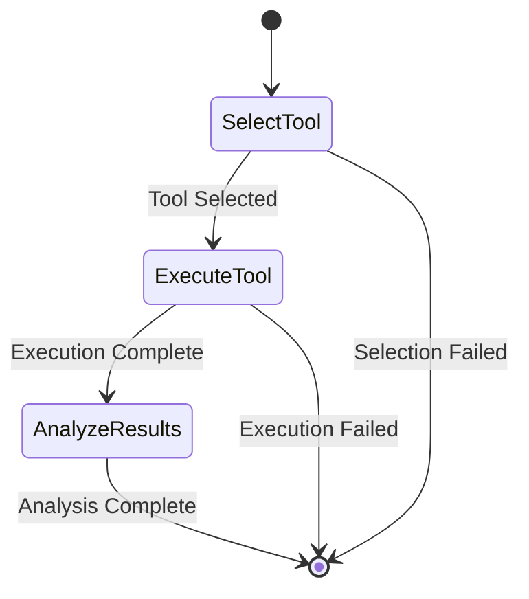
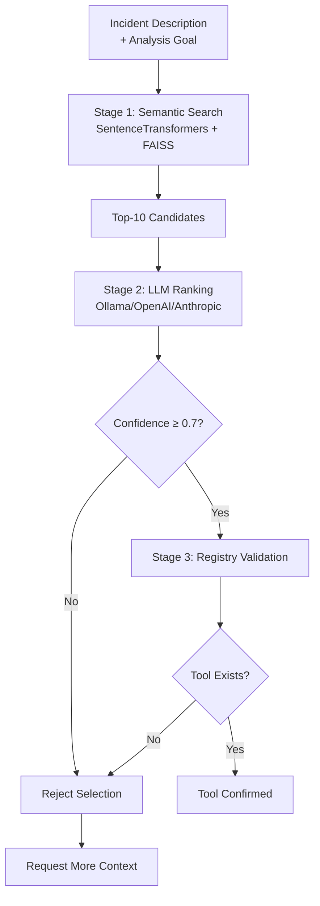
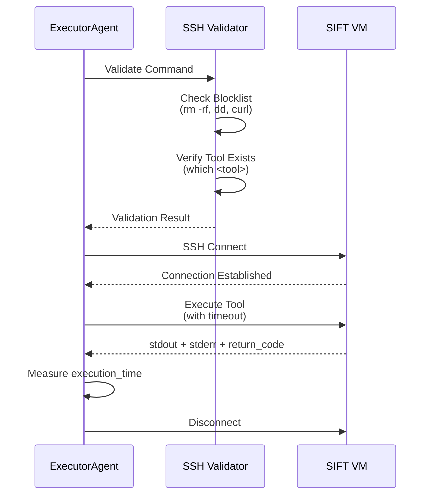
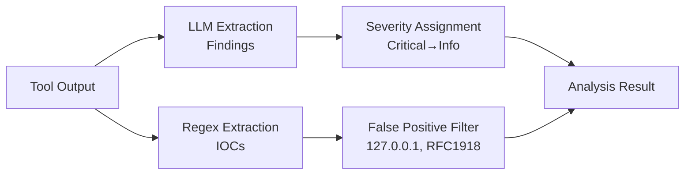
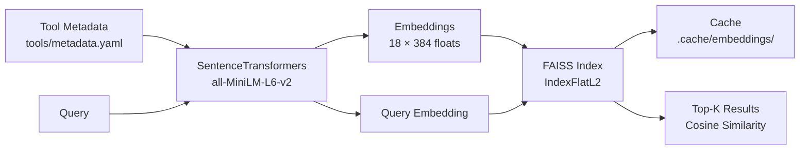
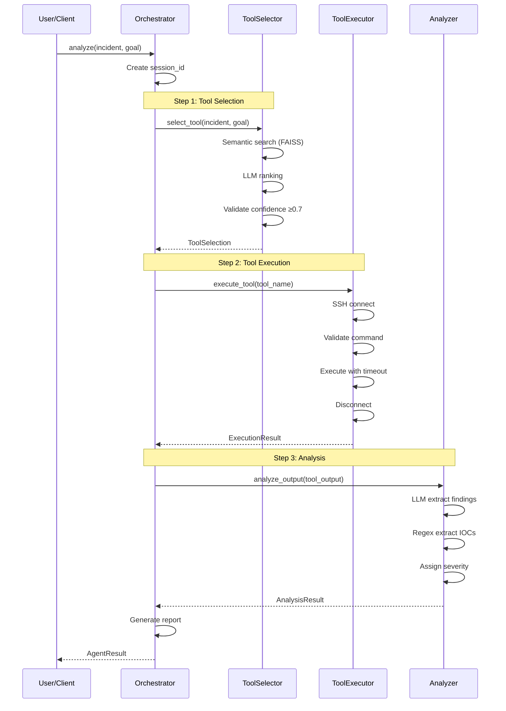
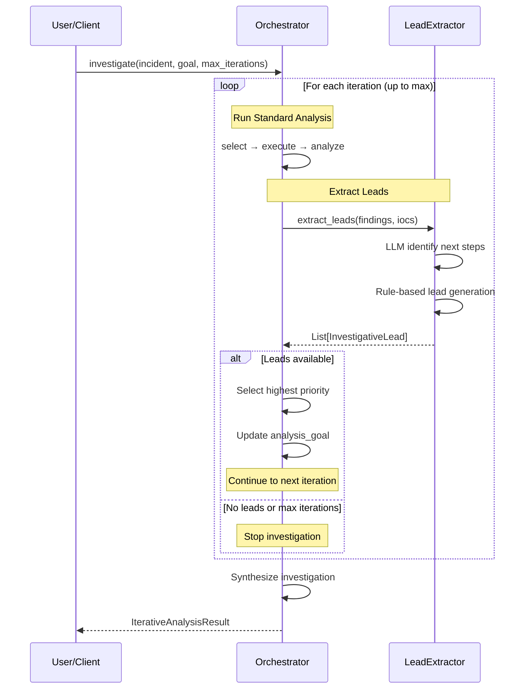
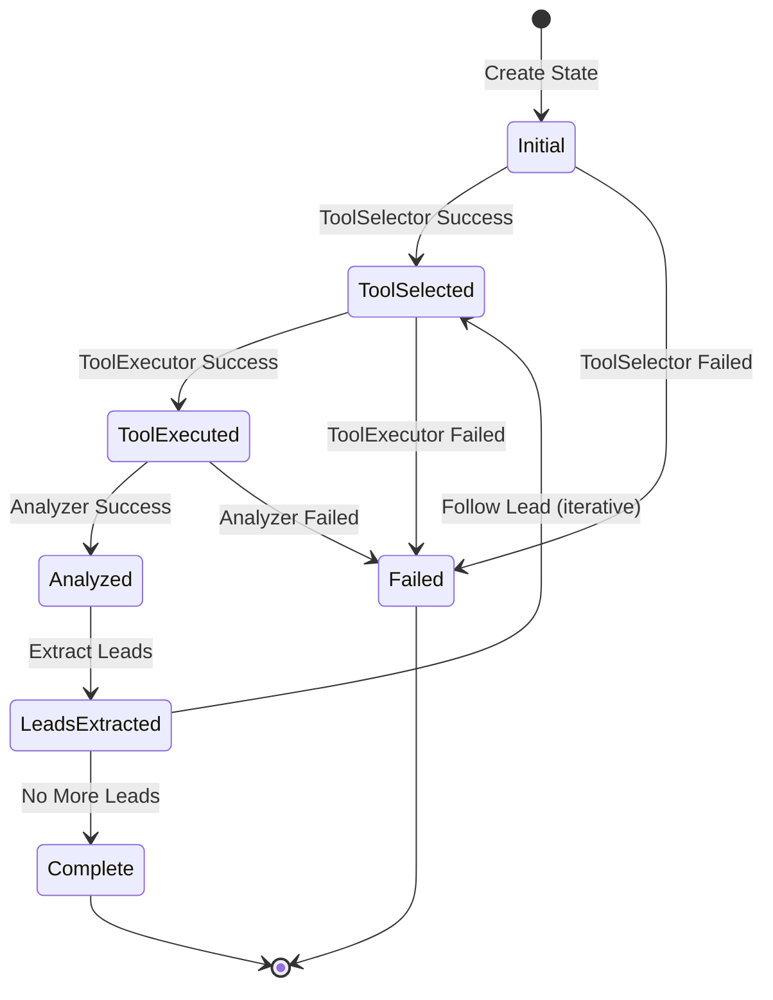
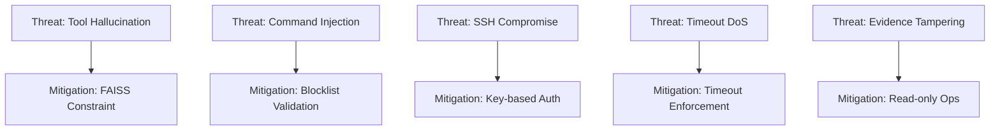

# Architecture

Find Evil Agent uses a multi-agent architecture orchestrated by LangGraph to provide hallucination-resistant tool selection and autonomous investigative reasoning.

## System Overview



## Component Architecture

### OrchestratorAgent

**Purpose:** Coordinates the 3-step analysis workflow using LangGraph.

**Workflow:**



**State Management:**

```python
@dataclass
class AgentState:
    session_id: str
    incident_description: str
    analysis_goal: str
    step: int
    tool_selection: Optional[ToolSelection]
    execution_result: Optional[ExecutionResult]
    analysis_result: Optional[AnalysisResult]
    errors: List[str]
```

**Key Responsibilities:**

- Workflow orchestration
- State management across agents
- Error handling and recovery
- Report generation

### ToolSelectorAgent

**Purpose:** Two-stage tool selection with hallucination prevention.

**Algorithm:**



**Hallucination Prevention:**

1. **Semantic Search:** Narrows to real tools only (FAISS index of 18 tools)
2. **LLM Ranking:** Selects best tool with reasoning
3. **Confidence Threshold:** Rejects uncertain selections (≥0.7 required)
4. **Registry Validation:** Confirms tool exists before execution

**Key Features:**

- Impossible to hallucinate tools (FAISS only returns real tools)
- Confidence scoring prevents low-quality selections
- Alternative tools provided for transparency
- Reasoning captured for audit trail

### ToolExecutorAgent

**Purpose:** Execute SIFT tools safely on remote VM via SSH.

**Execution Flow:**



**Security Features:**

```python
BLOCKED_COMMANDS = [
    "rm -rf",      # Destructive deletion
    "dd if=",      # Disk operations
    "dd of=",      # Disk writing
    "curl",        # External downloads
    "wget",        # External downloads
    "chmod +x",    # Permission changes
    "> /dev/",     # Device access
]
```

**Key Responsibilities:**

- SSH connection management
- Command validation
- Timeout enforcement (60s default, 3600s max)
- Evidence integrity (read-only operations)

### AnalyzerAgent

**Purpose:** Extract findings and IOCs from tool output.

**Analysis Pipeline:**



**IOC Extraction:**

| IOC Type | Pattern | Example |
|----------|---------|---------|
| IPv4 | `\b(?:[0-9]{1,3}\.){3}[0-9]{1,3}\b` | 203.0.113.42 |
| IPv6 | `\b(?:[0-9a-fA-F]{1,4}:){7}[0-9a-fA-F]{1,4}\b` | 2001:db8::1 |
| Domain | `\b(?:[a-z0-9]+(?:-[a-z0-9]+)*\.)+[a-z]{2,}\b` | evil-c2.net |
| MD5 | `\b[a-f0-9]{32}\b` | 5d41402abc4b2a76b9719d911017c592 |
| SHA1 | `\b[a-f0-9]{40}\b` | aaf4c61ddcc5e8a2dabede0f3b482cd9aea9434d |
| SHA256 | `\b[a-f0-9]{64}\b` | 2c26b46b68ffc68ff99b453c1d30413413422d706... |
| File Path | `/(?:[a-zA-Z0-9_.-]+/)*[a-zA-Z0-9_.-]+` | /tmp/malware.exe |

**Severity Levels:**

- **Critical:** Active exploitation, encryption, data theft
- **High:** Backdoors, C2 communication, malware
- **Medium:** Suspicious activity, unknown processes
- **Low:** Anomalies, unusual behavior
- **Info:** System information, benign findings

### ToolRegistry

**Purpose:** Catalog of 18 SIFT forensic tools with semantic search.

**Tool Categories:**

| Category | Tools | Count |
|----------|-------|-------|
| Memory Analysis | volatility | 1 |
| Disk Forensics | fls, icat, foremost, scalpel | 4 |
| Timeline | log2timeline, plaso | 2 |
| Network | tcpdump, wireshark, bulk_extractor | 3 |
| Analysis | strings, grep, pdf-parser, pescanner | 4 |
| Hashing | hashdeep, ssdeep | 2 |
| Metadata | exiftool, regripper | 2 |

**Semantic Search Architecture:**



**Cache Strategy:**

- Embeddings cached to `.cache/embeddings/tool_embeddings.npy`
- FAISS index cached to `.cache/embeddings/faiss.index`
- Regenerated if `tools/metadata.yaml` modified
- Performance: 8s → <1s on subsequent searches

## Data Flow

### Single-Shot Analysis



### Autonomous Investigation



## Technology Stack

### Core Dependencies

| Package | Version | Purpose |
|---------|---------|---------|
| langgraph | 0.2+ | Multi-agent orchestration |
| langchain-core | 0.3+ | Agent framework |
| sentence-transformers | 3.3+ | Text embeddings |
| faiss-cpu | 1.9+ | Vector similarity search |
| asyncssh | 2.14+ | SSH client library |
| pydantic | 2.5+ | Data validation |
| structlog | 24+ | Structured logging |

### Interface Dependencies

| Package | Version | Purpose |
|---------|---------|---------|
| typer | 0.12+ | CLI framework |
| rich | 13+ | Terminal formatting |
| fastapi | 0.115+ | REST API |
| mcp | 1.0+ | Model Context Protocol |

### LLM Providers

| Provider | Library | Models |
|----------|---------|--------|
| Ollama | httpx | gemma4, llama3.2, mistral |
| OpenAI | openai | gpt-4, gpt-4-turbo |
| Anthropic | anthropic | claude-3-opus, claude-3-sonnet |

### Observability

| Tool | Purpose | Port |
|------|---------|------|
| Langfuse | LLM tracing and monitoring | 33000 |
| Prometheus | Metrics collection | 60090 |
| structlog | Structured logging | N/A |

## State Management

### AgentState Schema

```python
@dataclass
class AgentState:
    """Shared state across LangGraph workflow."""
    
    # Session metadata
    session_id: str
    timestamp: datetime
    
    # Input
    incident_description: str
    analysis_goal: str
    
    # Workflow state
    step: int
    errors: List[str]
    
    # Agent outputs
    selected_tools: List[ToolSelection]
    execution_results: List[ExecutionResult]
    analysis_results: List[AnalysisResult]
    
    # Iterative investigation
    investigative_leads: List[InvestigativeLead]
    investigation_chain: List[Optional[InvestigativeLead]]
```

### State Transitions



## Performance Characteristics

### Latency Breakdown

**Typical Analysis (90s total):**

| Component | Duration | % of Total |
|-----------|----------|-----------|
| Tool Selection | 30s | 33% |
| - Semantic search | <1s | <1% |
| - LLM ranking | 29s | 32% |
| Tool Execution | 45s | 50% |
| - SSH connect | 0.1s | <1% |
| - Command execution | 44.9s | 50% |
| Analysis | 15s | 17% |
| - LLM extraction | 12s | 13% |
| - IOC regex | 3s | 3% |

### Optimizations Applied

1. **FAISS Embeddings Cache:** 8s → <1s on subsequent searches
2. **SSH Connection Reuse:** Single connection per workflow
3. **Lazy LLM Initialization:** Skip in tests
4. **Parallel Analysis:** IOC extraction concurrent with LLM

### Bottlenecks

- **LLM Generation:** 60-80% of total time (tool selection + analysis)
- **Tool Execution:** Varies by tool (strings: 0.2s, volatility: 90s)
- **Network Latency:** 4-5ms to SIFT VM (local network)

## Error Handling

### Graceful Degradation

```python
# Tool selection fallback
try:
    selection = await selector.select_tool(incident, goal)
except LLMError:
    # Fallback to semantic search only
    selection = await selector.semantic_fallback(incident, goal)

# Analysis fallback
try:
    findings = await analyzer.llm_extract_findings(output)
except LLMError:
    # Fallback to regex-based extraction
    findings = await analyzer.regex_fallback(output)
```

### Error Categories

| Category | Handling | Recovery |
|----------|----------|----------|
| **Network Errors** | Retry with backoff | 3 attempts, exponential |
| **SSH Errors** | Connection pool | Reconnect on failure |
| **LLM Errors** | Fallback to regex | Continue without LLM |
| **Timeout Errors** | Kill process | Return partial output |
| **Validation Errors** | Reject command | Request user input |

## Security Architecture

### Threat Model



### Security Controls

1. **Tool Hallucination:** FAISS only returns real tools from registry
2. **Command Injection:** Blocklist prevents destructive commands
3. **SSH Security:** Key-based authentication, no passwords
4. **Timeout DoS:** Configurable timeouts (60s default, 3600s max)
5. **Evidence Integrity:** Read-only operations on SIFT VM

## Next Steps

- [Components Deep Dive](components.md) - Detailed component documentation
- [Workflows](workflows.md) - Common workflow patterns
- [API Reference](api/cli.md) - Complete API documentation
- [Deployment](deployment/sift-setup.md) - Deployment and security guide
