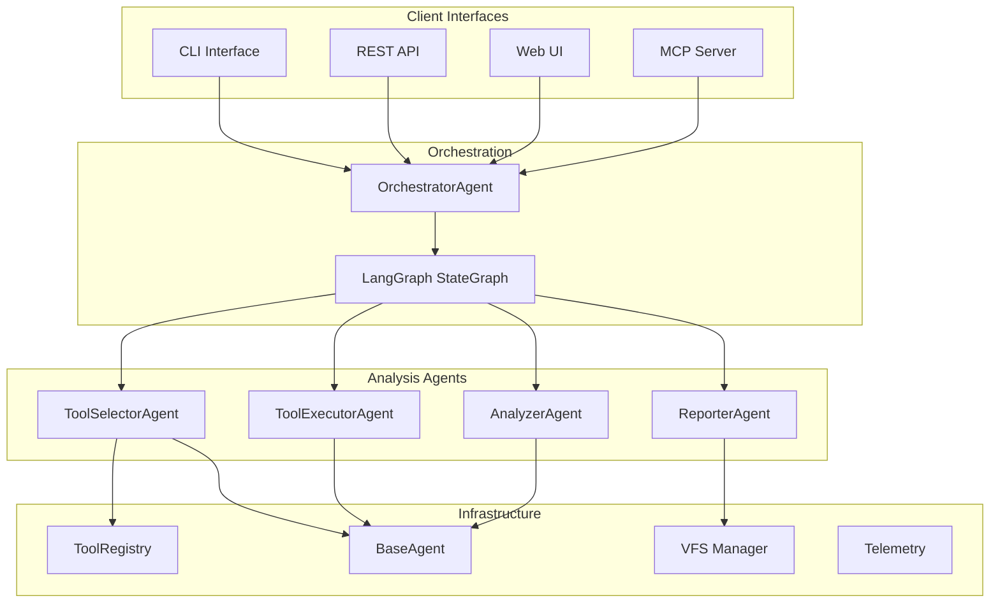
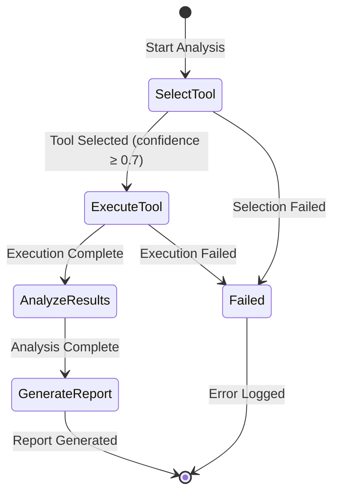
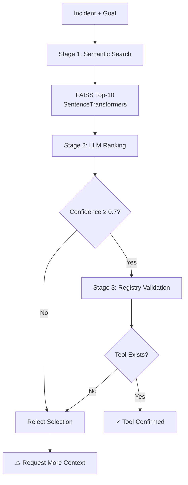
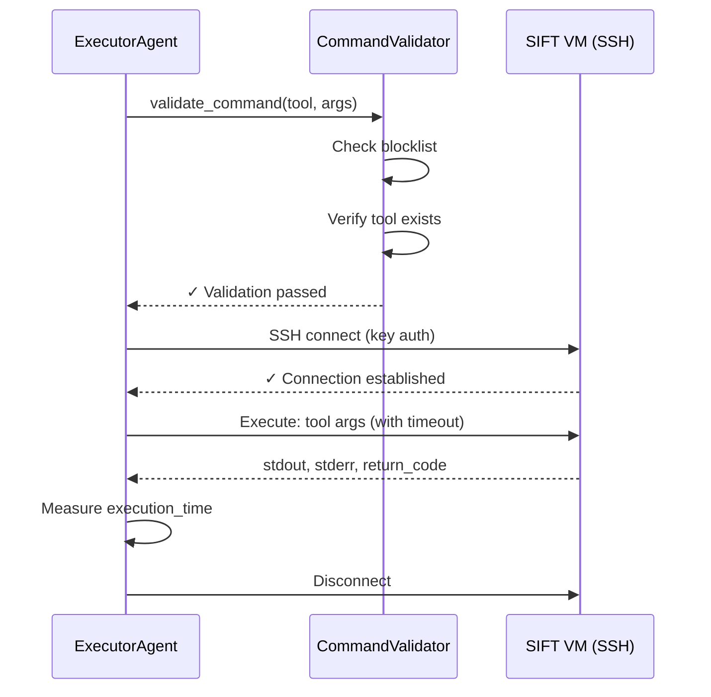
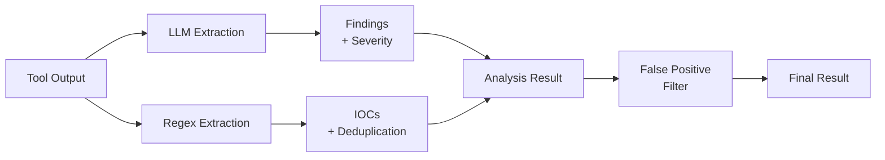
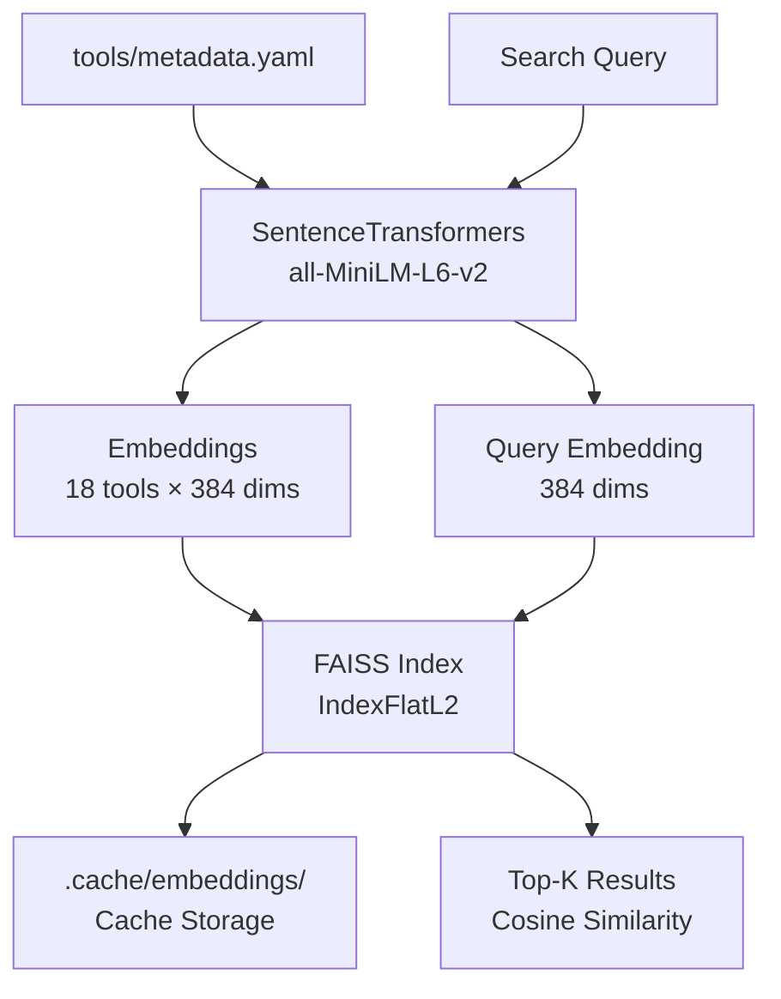
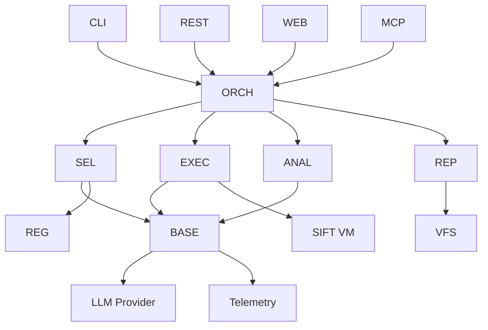

# Components

Find Evil Agent is built on a modular, multi-agent architecture with specialized components for each stage of incident response analysis.

## Component Overview



## Client Interfaces

### CLI Interface

**Location:** `src/find_evil_agent/cli/`

**Technology:** Typer 0.12+ with Rich UI

**Features:**

- **Commands:**
    - `analyze` - Single-shot analysis with hallucination prevention
    - `investigate` - Autonomous multi-iteration investigation
    - `config` - Display current configuration
    - `version` - Show version information
- **Rich Output:**
    - Progress spinners during execution
    - Color-coded severity levels (Critical=red, High=orange, etc.)
    - Formatted tables for IOCs and findings
    - Real-time status updates
- **Report Formats:**
    - Markdown (`.md`) - Default format
    - HTML (`.html`) - With D3.js graph visualization
    - PDF (`.pdf`) - Professional IR report format

**Usage Example:**

```bash
# Single analysis with verbose output
find-evil analyze \
  "Suspicious PowerShell execution on endpoint" \
  "Identify command-line arguments and script content" \
  --output report.md \
  --verbose

# Investigation with 5 iterations
find-evil investigate \
  "Unknown process consuming 100% CPU" \
  "Identify process origin and related artifacts" \
  --max-iterations 5 \
  --output investigation.html
```

**See Also:** [CLI Reference](api/cli.md)

---

### REST API

**Location:** `src/find_evil_agent/api/`

**Technology:** FastAPI 0.115+ with OpenAPI 3.1

**Endpoints:**

| Endpoint | Method | Purpose |
|----------|--------|---------|
| `/health` | GET | Service health check |
| `/api/v1/analyze` | POST | Single-shot analysis |
| `/api/v1/investigate` | POST | Autonomous investigation |
| `/api/v1/sessions/{id}` | GET | Retrieve session details |
| `/api/v1/tools` | GET | List available SIFT tools |

**Authentication:**

```python
# Optional API key authentication
headers = {
    "X-API-Key": "your-api-key-here",
    "Content-Type": "application/json"
}
```

**Request Example:**

```json
{
  "incident_description": "Ransomware detected on Windows 10 endpoint",
  "analysis_goal": "Identify encryption mechanism and C2 infrastructure",
  "llm_provider": "ollama",
  "llm_model": "gemma2:27b"
}
```

**Response Example:**

```json
{
  "session_id": "a1b2c3d4-e5f6-7890-abcd-ef1234567890",
  "status": "completed",
  "tool_selection": {
    "tool_name": "volatility",
    "confidence": 0.92,
    "reasoning": "Memory analysis best suited for ransomware detection"
  },
  "findings": [...],
  "iocs": {...},
  "report": "..."
}
```

**See Also:** [REST API Reference](api/rest.md)

---

### Web UI

**Location:** `frontend/` (React) and `src/find_evil_agent/web/` (Gradio)

**Technologies:**

- **React UI:** Vite + TypeScript + TailwindCSS
- **Gradio UI:** Gradio 4.0+ with Blocks API

**Features:**

- Real-time progress updates via Server-Sent Events (SSE)
- Interactive HTML report preview with D3.js graphs
- Model selection (Ollama/OpenAI/Anthropic)
- Download reports in multiple formats
- Tabbed interface for analysis vs. investigation modes

**Access:**

```bash
# React UI
docker compose up -d
open http://localhost:15173

# Gradio UI
find-evil web --port 17000
open http://localhost:17000
```

**See Also:** [Web Interface Guide](WEB_INTERFACE.md)

---

### MCP Server

**Location:** `src/find_evil_agent/mcp/`

**Technology:** FastMCP 1.0+ (Model Context Protocol)

**Purpose:** Integration with Claude and other MCP-compatible LLMs

**Tools Exposed:**

1. `analyze_incident` - Single-shot analysis
2. `investigate_incident` - Multi-iteration investigation
3. `list_tools` - Show available SIFT tools
4. `get_tool_info` - Tool metadata lookup
5. `validate_command` - Security validation
6. `extract_iocs` - IOC extraction from text
7. `search_tools` - Semantic tool search
8. `get_session` - Retrieve session results
9. `list_sessions` - List all sessions
10. `get_findings` - Extract findings from results
11. `get_report` - Generate formatted report
12. `health_check` - Server health status

**Resources:**

- `tool://{tool_name}` - Tool metadata
- `session://{session_id}` - Session details
- `registry://tools` - Complete tool registry
- `config://settings` - Configuration snapshot

**Usage with Claude Desktop:**

```json
{
  "mcpServers": {
    "find-evil": {
      "command": "uv",
      "args": [
        "--directory",
        "/path/to/find-evil-agent",
        "run",
        "find-evil-mcp"
      ]
    }
  }
}
```

**See Also:** [MCP Reference](api/mcp.md)

---

## Orchestration Layer

### OrchestratorAgent

**Location:** `src/find_evil_agent/agents/orchestrator/`

**Purpose:** Coordinates the 3-step analysis workflow using LangGraph

**State Management:**

```python
@dataclass
class AgentState:
    """Shared state across all agents in workflow"""
    session_id: str                              # Unique session identifier
    incident_description: str                    # User's incident description
    analysis_goal: str                           # Desired analysis outcome
    step: int                                    # Current workflow step (1-3)
    tool_selection: Optional[ToolSelection]      # From ToolSelectorAgent
    execution_result: Optional[ExecutionResult]  # From ToolExecutorAgent
    analysis_result: Optional[AnalysisResult]    # From AnalyzerAgent
    errors: List[str]                            # Error accumulator
    metadata: Dict[str, Any]                     # Session metadata
```

**Workflow Graph:**



**Key Responsibilities:**

1. **Workflow Coordination** - Manages agent execution order
2. **State Persistence** - Checkpointing via LangGraph
3. **Error Handling** - Graceful degradation on failures
4. **Report Generation** - Aggregates results into final report
5. **Telemetry** - Emits events to Langfuse/Prometheus

**Supported Workflows:**

- **Single-Shot Analysis:** Select → Execute → Analyze (3 steps)
- **Autonomous Investigation:** Multiple iterations with lead extraction
- **Human-in-the-Loop (HITL):** Pause for user confirmation

**See Also:** [Workflows](workflows.md), [Architecture](architecture.md#orchestratoragent)

---

### LangGraph Integration

**Technology:** LangGraph 0.2+

**Purpose:** Provides stateful workflow orchestration with checkpointing

**Features:**

- **Conditional Edges:** Route based on state (e.g., skip execution if selection fails)
- **Parallel Execution:** Run independent agents concurrently (future)
- **Checkpointing:** Resume workflows after failures
- **Event Streaming:** Real-time progress updates to clients

**Graph Definition:**

```python
from langgraph.graph import StateGraph

workflow = StateGraph(AgentState)
workflow.add_node("select_tool", tool_selector_node)
workflow.add_node("execute_tool", tool_executor_node)
workflow.add_node("analyze_results", analyzer_node)

workflow.set_entry_point("select_tool")
workflow.add_edge("select_tool", "execute_tool")
workflow.add_edge("execute_tool", "analyze_results")
workflow.add_edge("analyze_results", END)
```

**See Also:** [LangGraph Documentation](https://langchain-ai.github.io/langgraph/)

---

## Analysis Agents

### ToolSelectorAgent

**Location:** `src/find_evil_agent/agents/tool_selector.py`

**Purpose:** Two-stage tool selection with hallucination prevention

**Algorithm:**



**Stage 1: Semantic Search**

- **Model:** `all-MiniLM-L6-v2` (SentenceTransformers)
- **Index:** FAISS `IndexFlatL2` with 18 tools
- **Output:** Top-10 candidates with similarity scores
- **Why:** Guarantees only real tools considered (impossible to hallucinate)

**Stage 2: LLM Ranking**

- **Input:** Top-10 candidates + incident + goal
- **Providers:** Ollama / OpenAI / Anthropic
- **Output:** Best tool + confidence score (0.0-1.0) + reasoning
- **Why:** Applies forensic expertise to select optimal tool

**Stage 3: Validation**

- **Check 1:** Confidence ≥ 0.7 threshold
- **Check 2:** Tool exists in ToolRegistry
- **Check 3:** Tool has valid metadata (command, inputs, outputs)
- **Why:** Final safety check before execution

**Output Structure:**

```python
@dataclass
class ToolSelection:
    tool_name: str           # e.g., "volatility"
    confidence: float        # 0.92
    reasoning: str           # "Memory analysis best for ransomware..."
    alternatives: List[str]  # ["strings", "foremost"]
    execution_time: float    # 1.23 seconds
```

**Example:**

```python
selection = tool_selector.select_tool(
    incident="Suspicious PowerShell execution",
    goal="Extract command-line arguments"
)
# Result: strings (confidence: 0.88)
```

**See Also:** [Architecture - ToolSelectorAgent](architecture.md#toolselectoragent)

---

### ToolExecutorAgent

**Location:** `src/find_evil_agent/agents/executor.py`

**Purpose:** Execute SIFT tools safely on remote VM via SSH

**Security Layers:**

1. **Blocklist Validation** - Prevent destructive commands
2. **SSH Key Auth** - No password prompts
3. **Timeout Enforcement** - 60s default, 3600s max
4. **Read-Only Operations** - No modifications to evidence
5. **Command Logging** - Full audit trail via Langfuse

**Blocked Commands:**

```python
BLOCKED_COMMANDS = [
    "rm -rf",      # Destructive deletion
    "dd if=",      # Disk read operations
    "dd of=",      # Disk write operations
    "curl",        # External downloads
    "wget",        # External downloads
    "chmod +x",    # Permission changes
    "> /dev/",     # Device access
    "mkfs",        # Filesystem creation
    "fdisk",       # Partitioning
]
```

**Execution Flow:**



**Output Structure:**

```python
@dataclass
class ExecutionResult:
    stdout: str              # Tool output
    stderr: str              # Error messages
    return_code: int         # 0 = success
    execution_time: float    # 0.15 seconds
    command: str             # Full command executed
    tool_name: str           # "strings"
```

**SSH Configuration:**

```bash
# Required in .env
SIFT_VM_HOST=192.168.12.101
SIFT_VM_PORT=22
SIFT_SSH_USER=sansforensics
# SSH key forwarded via docker compose (SSH_AUTH_SOCK)
```

**See Also:** [SIFT VM Setup](deployment/sift-setup.md), [Security](deployment/security.md)

---

### AnalyzerAgent

**Location:** `src/find_evil_agent/agents/analyzer.py`

**Purpose:** Extract findings and IOCs from tool output

**Analysis Pipeline:**



**Finding Extraction (LLM):**

- **Input:** Tool stdout + stderr
- **Output:** List of findings with severity
- **Severity Levels:**
    - `CRITICAL` - Active exploitation, encryption, data exfiltration
    - `HIGH` - Backdoors, C2 communication, malware execution
    - `MEDIUM` - Suspicious processes, unusual network connections
    - `LOW` - Anomalies, configuration issues
    - `INFO` - System information, benign artifacts

**IOC Extraction (Regex):**

| IOC Type | Regex Pattern | Example |
|----------|---------------|---------|
| IPv4 | `\b(?:[0-9]{1,3}\.){3}[0-9]{1,3}\b` | 203.0.113.42 |
| IPv6 | `\b(?:[0-9a-fA-F]{1,4}:){7}[0-9a-fA-F]{1,4}\b` | 2001:db8::1 |
| Domain | `\b(?:[a-z0-9](?:[a-z0-9-]*[a-z0-9])?\.)+[a-z]{2,}\b` | evil-c2.net |
| MD5 | `\b[a-f0-9]{32}\b` | 5d41402abc4b2a76... |
| SHA1 | `\b[a-f0-9]{40}\b` | aaf4c61ddcc5e8a2... |
| SHA256 | `\b[a-f0-9]{64}\b` | 2c26b46b68ffc68f... |
| File Path | `/(?:[a-zA-Z0-9_.-]+/)*[a-zA-Z0-9_.-]+` | /tmp/malware.exe |
| Email | `\b[a-zA-Z0-9._%+-]+@[a-zA-Z0-9.-]+\.[a-zA-Z]{2,}\b` | attacker@evil.com |

**False Positive Filtering:**

```python
# Excluded from IOC results
EXCLUDED_IPS = [
    "127.0.0.1",        # Localhost
    "0.0.0.0",          # Wildcard
    "10.0.0.0/8",       # RFC1918 private
    "172.16.0.0/12",    # RFC1918 private
    "192.168.0.0/16",   # RFC1918 private
]

EXCLUDED_DOMAINS = [
    "localhost",
    "example.com",
    "microsoft.com",    # Known good
    "apple.com",        # Known good
]
```

**Output Structure:**

```python
@dataclass
class AnalysisResult:
    findings: List[Finding]      # Extracted findings
    iocs: Dict[str, List[str]]   # IOCs by type
    summary: str                 # LLM-generated summary
    severity: str                # Overall severity
    execution_time: float        # 2.34 seconds
```

**See Also:** [Understanding Results](results.md)

---

### ReporterAgent

**Location:** `src/find_evil_agent/agents/reporter.py`

**Purpose:** Generate professional IR reports in multiple formats

**Report Formats:**

1. **Markdown** (`.md`) - Human-readable, version-controllable
2. **HTML** (`.html`) - Interactive with D3.js graph visualization
3. **PDF** (`.pdf`) - Professional IR format with headers/footers

**Report Structure:**

```markdown
# Incident Response Analysis Report

## Executive Summary
[LLM-generated summary of findings]

## Incident Details
- **Description:** [User-provided incident description]
- **Analysis Goal:** [User-provided analysis goal]
- **Timestamp:** 2026-05-08 21:45:00 UTC
- **Session ID:** a1b2c3d4-e5f6-7890

## Tool Selection
- **Selected Tool:** volatility
- **Confidence:** 0.92 (92%)
- **Reasoning:** Memory analysis best suited for ransomware detection
- **Alternatives:** strings, foremost

## Findings (3 total)

### Finding 1: Malicious Process Detected [CRITICAL]
[Detailed finding description...]

### Finding 2: Suspicious Network Connection [HIGH]
[Detailed finding description...]

## Indicators of Compromise (IOCs)

### IP Addresses (2)
- 203.0.113.42
- 198.51.100.17

### File Paths (1)
- /tmp/ransomware.exe

## Recommendations
[LLM-generated remediation steps]
```

**Graph Visualization:**

The HTML report includes an interactive D3.js force-directed graph showing relationships between:

- Incident → Tool Selection
- Tool → Findings
- Findings → IOCs

**See Also:** [Examples](examples.md#report-examples)

---

## Infrastructure Layer

### ToolRegistry

**Location:** `src/find_evil_agent/tools/registry.py`

**Purpose:** Catalog of 18 SIFT forensic tools with semantic search

**Tool Categories:**

| Category | Tools | Description |
|----------|-------|-------------|
| **Memory Analysis** | volatility | Memory dump analysis, process inspection |
| **Disk Forensics** | fls, icat, foremost, scalpel | File system analysis, data carving |
| **Timeline Analysis** | log2timeline, plaso | Event timeline reconstruction |
| **Network Forensics** | tcpdump, wireshark, bulk_extractor | Packet capture, network IOC extraction |
| **File Analysis** | strings, grep, pdf-parser, pescanner | Content extraction, PE binary analysis |
| **Hashing** | hashdeep, ssdeep | File integrity, fuzzy hashing |
| **Metadata** | exiftool, regripper | EXIF data, Windows registry parsing |

**Semantic Search Architecture:**



**Tool Metadata Example:**

```yaml
- name: volatility
  description: Advanced memory forensics framework for analyzing RAM dumps
  category: memory_analysis
  command: volatility
  typical_use_cases:
    - Process listing and analysis
    - Network connection enumeration
    - Malware detection in memory
    - DLL and driver analysis
  inputs:
    - Memory dump file (.raw, .vmem, .mem)
    - Profile specification (Win10x64, Linux, etc.)
  outputs:
    - Process trees
    - Network connections
    - Loaded modules
    - Registry keys accessed
```

**Search Example:**

```python
from find_evil_agent.tools.registry import ToolRegistry

registry = ToolRegistry()
results = registry.search("analyze memory dump for malware")

# Returns:
# 1. volatility (similarity: 0.89)
# 2. strings (similarity: 0.72)
# 3. grep (similarity: 0.68)
```

**Cache Performance:**

- **First search:** ~8 seconds (embedding generation)
- **Subsequent searches:** <1 second (cached embeddings)
- **Cache invalidation:** On `tools/metadata.yaml` modification

**See Also:** [Architecture - ToolRegistry](architecture.md#toolregistry)

---

### BaseAgent

**Location:** `src/find_evil_agent/agents/base.py`

**Purpose:** Shared functionality for all agents with lazy LLM initialization

**Features:**

1. **Lazy LLM Loading** - Don't initialize LLM until first use (critical for tests)
2. **Provider Abstraction** - Support Ollama / OpenAI / Anthropic
3. **Telemetry Integration** - Automatic Langfuse tracing
4. **Error Handling** - Consistent exception handling across agents

**Usage:**

```python
from find_evil_agent.agents.base import BaseAgent

class CustomAgent(BaseAgent):
    def run(self, task: str) -> str:
        # LLM not loaded until this line executes
        response = self.llm.invoke(f"Analyze: {task}")
        return response.content
```

**LLM Provider Selection:**

```python
# Via environment variable
LLM_PROVIDER=ollama  # or "openai", "anthropic"

# Via runtime override
agent = CustomAgent(llm_provider="openai", llm_model="gpt-4")
```

**See Also:** [LLM Configuration](deployment/llm-config.md)

---

### VFS Manager

**Location:** `src/find_evil_agent/vfs/`

**Purpose:** Virtual file system for storing reports and artifacts

**Features:**

- **In-Memory Storage** - Fast access during analysis
- **Persistent Storage** - Write to disk at session end
- **Format Conversion** - Markdown → HTML → PDF
- **Artifact Management** - Screenshots, logs, extracted files

**Storage Structure:**

```
.vfs/
└── sessions/
    └── {session_id}/
        ├── report.md        # Markdown report
        ├── report.html      # HTML with D3.js
        ├── report.pdf       # PDF report
        ├── state.json       # AgentState snapshot
        └── artifacts/
            ├── tool_output.txt
            └── graph_data.json
```

---

### Telemetry

**Location:** `src/find_evil_agent/telemetry/`

**Purpose:** Observability via Langfuse + Prometheus + structlog

**Components:**

1. **Langfuse** - LLM call tracing, token usage, latency
2. **Prometheus** - Metrics (analysis_duration, tool_executions_total)
3. **structlog** - Structured JSON logging

**Metrics Exposed:**

```python
# Prometheus metrics at /metrics
analysis_duration_seconds       # Histogram
tool_executions_total          # Counter by tool_name
llm_tokens_total              # Counter by provider
analysis_errors_total         # Counter by error_type
```

**Langfuse Integration:**

```python
# Automatic tracing for all LLM calls
from langfuse.decorators import observe

@observe()
def analyze_incident(...):
    # All LLM calls traced to Langfuse
    pass
```

**See Also:** [Configuration - Telemetry](configuration.md#telemetry)

---

## Component Dependencies



## Next Steps

- [Architecture](architecture.md) - System design and data flow
- [Workflows](workflows.md) - Common workflow patterns
- [API Reference](api/cli.md) - Client interface documentation
- [Deployment](deployment/sift-setup.md) - Setup and configuration
