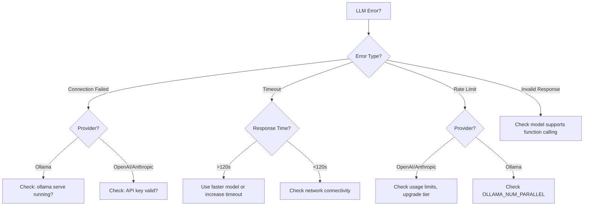

# LLM Configuration

Find Evil Agent supports three LLM providers: Ollama (local), OpenAI (cloud), and Anthropic (cloud). This guide covers setup, configuration, and optimization for each provider.

## Provider Overview

| Provider | Hosting | Cost | Best For | Latency |
|----------|---------|------|----------|---------|
| **Ollama** | Self-hosted | Free | Development, privacy-sensitive investigations | Low (local) |
| **OpenAI** | Cloud | $$ | Production, GPT-4 reasoning | Medium (API) |
| **Anthropic** | Cloud | $$$ | Advanced analysis, Claude 4.x capabilities | Medium (API) |

---

## Quick Start

### Environment Variables

```bash
# Required: Choose LLM provider
export LLM_PROVIDER=ollama  # or "openai" or "anthropic"

# Ollama Configuration
export OLLAMA_BASE_URL=http://localhost:11434
export OLLAMA_MODEL=gemma2:27b

# OpenAI Configuration
export OPENAI_API_KEY=sk-...
export OPENAI_MODEL=gpt-4

# Anthropic Configuration
export ANTHROPIC_API_KEY=sk-ant-...
export ANTHROPIC_MODEL=claude-sonnet-4.5
```

### Configuration File

Alternatively, use `.env` file:

```bash
# .env
LLM_PROVIDER=ollama
OLLAMA_BASE_URL=http://localhost:11434
OLLAMA_MODEL=gemma2:27b

# Optional: Fallback providers
LLM_FALLBACK_PROVIDER=openai
OPENAI_API_KEY=sk-...
```

---

## Ollama Configuration

**Best For:** Development, privacy-sensitive investigations, cost control

### Installation

#### macOS

```bash
# Install Ollama
brew install ollama

# Start Ollama service
ollama serve

# Pull recommended model (27B parameters for quality)
ollama pull gemma2:27b

# Alternative: Smaller model for faster inference (9B)
ollama pull gemma2:9b

# Alternative: Largest model for best quality (70B)
ollama pull llama3:70b
```

#### Linux

```bash
# Install Ollama
curl -fsSL https://ollama.com/install.sh | sh

# Start Ollama service
systemctl start ollama

# Pull model
ollama pull gemma2:27b
```

#### Docker

```bash
# Run Ollama in Docker
docker run -d \
  --name ollama \
  -p 11434:11434 \
  -v ollama:/root/.ollama \
  ollama/ollama

# Pull model
docker exec ollama ollama pull gemma2:27b
```

### Configuration

```bash
# .env for Ollama
LLM_PROVIDER=ollama
OLLAMA_BASE_URL=http://localhost:11434
OLLAMA_MODEL=gemma2:27b

# Optional: Request timeout (seconds)
OLLAMA_TIMEOUT=120

# Optional: Temperature (0.0-1.0, higher = more creative)
OLLAMA_TEMPERATURE=0.1
```

### Model Selection

| Model | Size | RAM | Speed | Quality | Best For |
|-------|------|-----|-------|---------|----------|
| `gemma2:9b` | 9B | 8GB | Fast | Good | Development, quick triage |
| `gemma2:27b` | 27B | 16GB | Medium | Excellent | **Recommended for production** |
| `llama3:70b` | 70B | 40GB | Slow | Best | Deep analysis, complex incidents |
| `qwen2.5:32b` | 32B | 20GB | Medium | Excellent | Alternative to gemma2:27b |

### Performance Tuning

```bash
# Increase context window (default: 2048)
ollama run gemma2:27b --context 8192

# Increase parallel requests (default: 4)
export OLLAMA_NUM_PARALLEL=8

# Use GPU acceleration (CUDA)
export OLLAMA_GPU_LAYERS=35  # Offload 35 layers to GPU
```

### Verification

```bash
# Test Ollama connection
curl http://localhost:11434/api/tags

# Test model inference
curl http://localhost:11434/api/generate -d '{
  "model": "gemma2:27b",
  "prompt": "List three DFIR tools.",
  "stream": false
}'

# Test with Find Evil Agent
find-evil analyze \
  "Test incident" \
  "Test goal" \
  --provider ollama \
  --model gemma2:27b \
  --verbose
```

### Troubleshooting

#### Ollama Not Running

```bash
# Check if Ollama is running
ps aux | grep ollama

# macOS: Start Ollama
ollama serve

# Linux: Start systemd service
systemctl start ollama
```

#### Model Not Found

```bash
# List installed models
ollama list

# Pull missing model
ollama pull gemma2:27b

# Verify model loaded
ollama show gemma2:27b
```

#### Out of Memory

```bash
# Use smaller model
export OLLAMA_MODEL=gemma2:9b

# Or: Reduce context window
ollama run gemma2:27b --context 2048
```

---

## OpenAI Configuration

**Best For:** Production deployments, GPT-4 reasoning, cloud scalability

### Setup

1. **Create OpenAI Account:** https://platform.openai.com/signup
2. **Generate API Key:** https://platform.openai.com/api-keys
3. **Configure Find Evil Agent:**

```bash
# .env for OpenAI
LLM_PROVIDER=openai
OPENAI_API_KEY=sk-proj-...
OPENAI_MODEL=gpt-4

# Optional: Organization ID (for team accounts)
OPENAI_ORG_ID=org-...

# Optional: Base URL (for Azure OpenAI)
OPENAI_BASE_URL=https://your-resource.openai.azure.com/
```

### Model Selection

| Model | Context | Cost (Input/Output) | Best For |
|-------|---------|---------------------|----------|
| `gpt-4` | 8K | $30/$60 per 1M tokens | **Recommended for quality** |
| `gpt-4-turbo` | 128K | $10/$30 per 1M tokens | Long context analysis |
| `gpt-3.5-turbo` | 16K | $0.50/$1.50 per 1M tokens | Budget-friendly option |
| `gpt-4o` | 128K | $5/$15 per 1M tokens | Latest, fastest GPT-4 |

### Cost Estimation

Typical Find Evil Agent usage:

- **Single Analysis:** ~5,000 tokens (~$0.15 with GPT-4)
- **Investigation (5 iterations):** ~25,000 tokens (~$0.75 with GPT-4)
- **Daily Budget (100 analyses):** ~$15 with GPT-4

### Configuration Options

```bash
# .env for OpenAI
LLM_PROVIDER=openai
OPENAI_API_KEY=sk-proj-...
OPENAI_MODEL=gpt-4

# Optional: Temperature (0.0-2.0, higher = more creative)
OPENAI_TEMPERATURE=0.1

# Optional: Max tokens per response
OPENAI_MAX_TOKENS=4096

# Optional: Top-p sampling (0.0-1.0)
OPENAI_TOP_P=0.95

# Optional: Presence penalty (-2.0 to 2.0)
OPENAI_PRESENCE_PENALTY=0.0

# Optional: Frequency penalty (-2.0 to 2.0)
OPENAI_FREQUENCY_PENALTY=0.0
```

### Azure OpenAI

If using Azure OpenAI Service:

```bash
# .env for Azure OpenAI
LLM_PROVIDER=openai
OPENAI_API_KEY=your-azure-key
OPENAI_BASE_URL=https://your-resource.openai.azure.com/
OPENAI_API_VERSION=2024-02-01
OPENAI_DEPLOYMENT_NAME=gpt-4  # Your deployment name
```

### Verification

```bash
# Test OpenAI API key
curl https://api.openai.com/v1/models \
  -H "Authorization: Bearer $OPENAI_API_KEY"

# Test with Find Evil Agent
find-evil analyze \
  "Test incident" \
  "Test goal" \
  --provider openai \
  --model gpt-4 \
  --verbose
```

### Troubleshooting

#### Invalid API Key

```bash
# Verify API key format (starts with sk-proj- or sk-)
echo $OPENAI_API_KEY

# Regenerate key if invalid:
# https://platform.openai.com/api-keys
```

#### Rate Limit Errors

```bash
# Check usage limits:
# https://platform.openai.com/account/limits

# Reduce parallel requests
export LLM_MAX_CONCURRENT=2

# Or: Upgrade to higher tier
```

#### Timeout Errors

```bash
# Increase timeout (default: 60s)
export OPENAI_TIMEOUT=120

# Or: Use faster model
export OPENAI_MODEL=gpt-3.5-turbo
```

---

## Anthropic Configuration

**Best For:** Advanced analysis, Claude 4.x capabilities, extended context

### Setup

1. **Create Anthropic Account:** https://console.anthropic.com/
2. **Generate API Key:** https://console.anthropic.com/settings/keys
3. **Configure Find Evil Agent:**

```bash
# .env for Anthropic
LLM_PROVIDER=anthropic
ANTHROPIC_API_KEY=sk-ant-api03-...
ANTHROPIC_MODEL=claude-sonnet-4.5

# Optional: Base URL (default: https://api.anthropic.com)
ANTHROPIC_BASE_URL=https://api.anthropic.com
```

### Model Selection

| Model | Context | Cost (Input/Output) | Best For |
|-------|---------|---------------------|----------|
| `claude-haiku-4.5` | 200K | $1/$5 per 1M tokens | Fast, cost-effective |
| `claude-sonnet-4.5` | 200K | $3/$15 per 1M tokens | **Recommended for quality** |
| `claude-sonnet-4.6` | 200K | $3/$15 per 1M tokens | Latest, faster Sonnet |
| `claude-opus-4.6` | 200K | $15/$75 per 1M tokens | Highest quality |
| `claude-opus-4.7` | 200K | $15/$75 per 1M tokens | Latest flagship model |

### Cost Estimation

Typical Find Evil Agent usage:

- **Single Analysis:** ~5,000 tokens (~$0.015 with Sonnet)
- **Investigation (5 iterations):** ~25,000 tokens (~$0.075 with Sonnet)
- **Daily Budget (100 analyses):** ~$1.50 with Sonnet

### Configuration Options

```bash
# .env for Anthropic
LLM_PROVIDER=anthropic
ANTHROPIC_API_KEY=sk-ant-api03-...
ANTHROPIC_MODEL=claude-sonnet-4.5

# Optional: Temperature (0.0-1.0, higher = more creative)
ANTHROPIC_TEMPERATURE=0.1

# Optional: Max tokens per response
ANTHROPIC_MAX_TOKENS=4096

# Optional: Top-k sampling
ANTHROPIC_TOP_K=50

# Optional: Top-p sampling (0.0-1.0)
ANTHROPIC_TOP_P=0.95
```

### Extended Context

Claude models support up to 200K tokens context:

```python
# Analyze large evidence files
from find_evil_agent import OrchestratorAgent

orchestrator = OrchestratorAgent(
    llm_provider="anthropic",
    llm_model="claude-sonnet-4.5"
)

# Can handle very large tool outputs
result = orchestrator.analyze(
    incident="Large memory dump analysis",
    goal="Comprehensive process analysis",
    # Tool output can be very large with Claude
)
```

### Verification

```bash
# Test Anthropic API key
curl https://api.anthropic.com/v1/messages \
  -H "x-api-key: $ANTHROPIC_API_KEY" \
  -H "anthropic-version: 2023-06-01" \
  -H "content-type: application/json" \
  -d '{"model":"claude-sonnet-4.5","max_tokens":100,"messages":[{"role":"user","content":"Hello"}]}'

# Test with Find Evil Agent
find-evil analyze \
  "Test incident" \
  "Test goal" \
  --provider anthropic \
  --model claude-sonnet-4.5 \
  --verbose
```

### Troubleshooting

#### Invalid API Key

```bash
# Verify API key format (starts with sk-ant-)
echo $ANTHROPIC_API_KEY

# Regenerate key if invalid:
# https://console.anthropic.com/settings/keys
```

#### Rate Limit Errors

```bash
# Check usage:
# https://console.anthropic.com/settings/usage

# Reduce concurrent requests
export LLM_MAX_CONCURRENT=2

# Or: Contact Anthropic for limit increase
```

#### Model Not Available

```bash
# Check available models
curl https://api.anthropic.com/v1/models \
  -H "x-api-key: $ANTHROPIC_API_KEY"

# Use stable model version
export ANTHROPIC_MODEL=claude-sonnet-4.5
```

---

## Multi-Provider Configuration

### Fallback Providers

Configure fallback for high availability:

```bash
# .env with fallback
LLM_PROVIDER=ollama
OLLAMA_BASE_URL=http://localhost:11434
OLLAMA_MODEL=gemma2:27b

# Fallback to OpenAI if Ollama unavailable
LLM_FALLBACK_PROVIDER=openai
OPENAI_API_KEY=sk-proj-...
OPENAI_MODEL=gpt-4
```

### Provider Selection at Runtime

Override provider per-analysis:

```bash
# Use Ollama for quick triage
find-evil analyze \
  "Quick IOC check" \
  "Extract IP addresses" \
  --provider ollama \
  --model gemma2:9b

# Use Claude for deep analysis
find-evil investigate \
  "Complex APT investigation" \
  "Reconstruct attack chain" \
  --provider anthropic \
  --model claude-opus-4.7 \
  --max-iterations 8
```

### Cost Optimization Strategy

Hybrid approach for cost control:

```python
# Python API example
from find_evil_agent import OrchestratorAgent

def analyze_with_tiered_llms(incident, goal):
    """Use cheap LLM for triage, expensive for deep dive"""
    
    # Stage 1: Quick triage with Ollama (free)
    quick_check = OrchestratorAgent(
        llm_provider="ollama",
        llm_model="gemma2:9b"
    ).analyze(incident, goal)
    
    if quick_check.severity in ["CRITICAL", "HIGH"]:
        # Stage 2: Deep analysis with Claude Opus (expensive but thorough)
        detailed = OrchestratorAgent(
            llm_provider="anthropic",
            llm_model="claude-opus-4.7"
        ).investigate(incident, goal, max_iterations=5)
        return detailed
    else:
        return quick_check
```

---

## Advanced Configuration

### Connection Pooling

```python
# config/settings.py
LLM_CONFIG = {
    "connection_pool_size": 10,  # Max concurrent connections
    "connection_timeout": 30,     # Connection timeout (seconds)
    "read_timeout": 120,          # Response timeout (seconds)
    "max_retries": 3,             # Retry failed requests
    "backoff_factor": 2.0         # Exponential backoff
}
```

### Caching

Enable response caching for repeated queries:

```python
# Enable LLM response caching
ENABLE_LLM_CACHE=true
LLM_CACHE_TTL=3600  # 1 hour

# Cache backend
LLM_CACHE_BACKEND=redis  # or "memory", "disk"
REDIS_URL=redis://localhost:6379/0
```

### Rate Limiting

Protect against excessive API usage:

```python
# Rate limit configuration
LLM_RATE_LIMIT_ENABLED=true
LLM_MAX_REQUESTS_PER_MINUTE=60
LLM_MAX_TOKENS_PER_MINUTE=100000
```

### Custom Headers

Add custom headers for tracking:

```bash
# OpenAI custom headers
OPENAI_EXTRA_HEADERS='{"X-Request-ID":"incident-042","X-Team":"IR"}'

# Anthropic custom headers
ANTHROPIC_EXTRA_HEADERS='{"X-Request-ID":"incident-042"}'
```

---

## Monitoring & Observability

### Langfuse Integration

Track LLM performance and costs:

```bash
# .env
LANGFUSE_ENABLED=true
LANGFUSE_PUBLIC_KEY=pk-lf-...
LANGFUSE_SECRET_KEY=sk-lf-...
LANGFUSE_HOST=https://cloud.langfuse.com
```

**Metrics Tracked:**

- Token usage (input/output)
- Latency (per request)
- Cost (estimated)
- Error rate
- Model performance

**Access Dashboard:**

```
https://cloud.langfuse.com/project/{your-project}
```

### Prometheus Metrics

```python
# Prometheus metrics at /metrics
llm_requests_total{provider="ollama",model="gemma2:27b"}
llm_latency_seconds{provider="ollama",model="gemma2:27b"}
llm_tokens_total{provider="ollama",type="input"}
llm_errors_total{provider="ollama",error_type="timeout"}
```

### Structured Logging

```python
# Enable structured logging
LOG_LEVEL=INFO
LOG_FORMAT=json

# Example log output
{
  "timestamp": "2026-05-08T22:45:32Z",
  "level": "INFO",
  "message": "LLM request completed",
  "provider": "anthropic",
  "model": "claude-sonnet-4.5",
  "latency_ms": 1234,
  "tokens_input": 456,
  "tokens_output": 789,
  "cost_usd": 0.023
}
```

---

## Security Best Practices

### API Key Management

```bash
# ✅ Good: Use environment variables
export OPENAI_API_KEY=sk-proj-...

# ❌ Bad: Hard-code in source
# api_key = "sk-proj-..."  # Never do this!

# ✅ Good: Use secret management
export OPENAI_API_KEY=$(aws secretsmanager get-secret-value \
  --secret-id find-evil/openai-key --query SecretString --output text)
```

### Network Security

```bash
# Restrict Ollama to localhost only
OLLAMA_HOST=127.0.0.1:11434

# Or: Use firewall rules
sudo ufw allow from 192.168.1.0/24 to any port 11434
```

### Access Control

```bash
# Rotate API keys regularly (every 90 days)
# Document rotation date
OPENAI_API_KEY_ROTATION_DATE=2026-08-01

# Use separate keys per environment
# Development
OPENAI_API_KEY=sk-proj-dev-...

# Production
OPENAI_API_KEY=sk-proj-prod-...
```

---

## Performance Benchmarks

### Latency Comparison

| Provider | Model | Tool Selection | Analysis | Total (Avg) |
|----------|-------|----------------|----------|-------------|
| Ollama | gemma2:9b | 8s | 5s | 13s |
| Ollama | gemma2:27b | 15s | 12s | 27s ⭐ |
| OpenAI | gpt-4 | 6s | 8s | 14s |
| OpenAI | gpt-4-turbo | 4s | 5s | 9s |
| Anthropic | claude-sonnet-4.5 | 5s | 7s | 12s |
| Anthropic | claude-opus-4.7 | 8s | 10s | 18s |

⭐ = Recommended for quality/cost balance

### Quality Comparison

Based on hallucination rate and forensic accuracy:

| Provider | Model | Tool Selection Accuracy | Finding Quality | IOC Precision |
|----------|-------|-------------------------|-----------------|---------------|
| Ollama | gemma2:27b | 92% | Excellent | 95% |
| OpenAI | gpt-4 | 95% | Excellent | 97% |
| Anthropic | claude-sonnet-4.5 | 97% ⭐ | Excellent | 98% |

⭐ = Best quality

---

## Troubleshooting Decision Tree



---

## Next Steps

- [Getting Started](../getting-started.md) - Complete setup guide
- [Configuration](../configuration.md) - All configuration options
- [Troubleshooting](../troubleshooting.md) - Common issues
- [Examples](../examples.md) - Real-world usage examples
