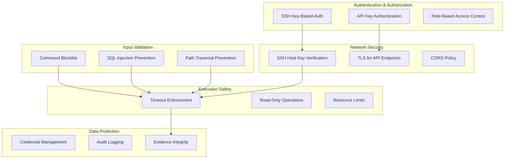
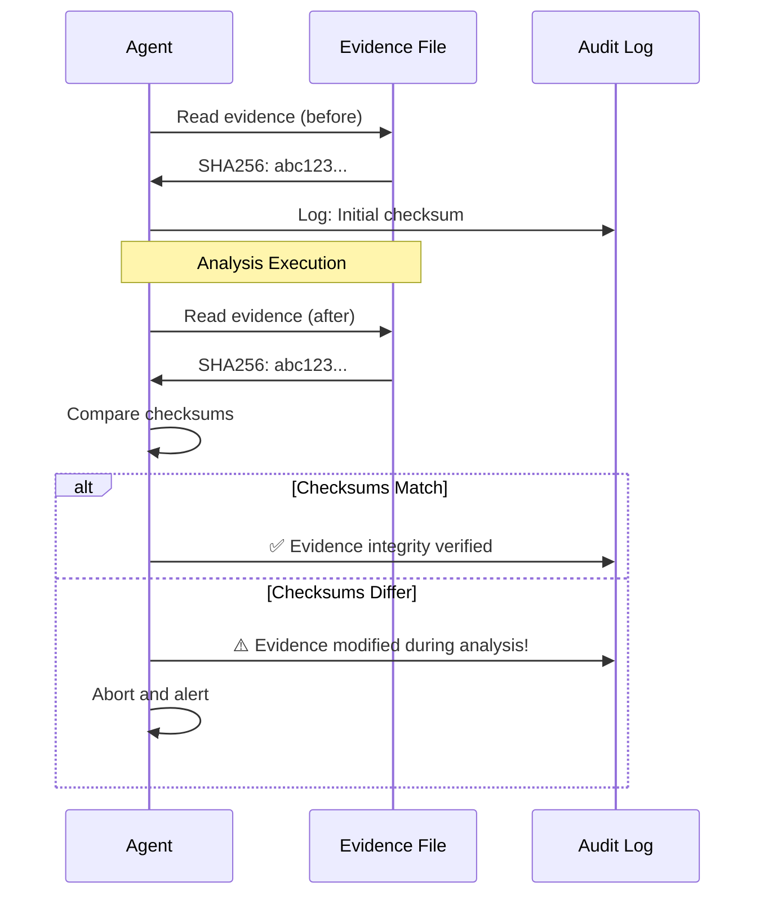

# Security

Find Evil Agent implements multiple security layers to protect against common threats in automated forensic analysis systems.

## Security Architecture



---

## Threat Model

### Threats Addressed

| Threat | Severity | Mitigation | Status |
|--------|----------|------------|--------|
| **Command Injection** | CRITICAL | Blocklist validation | ✅ Implemented |
| **SSH MitM Attack** | HIGH | Host key verification | ✅ Implemented |
| **Tool Hallucination** | HIGH | Two-stage selection + validation | ✅ Implemented |
| **Evidence Tampering** | HIGH | Read-only operations | ✅ Implemented |
| **API Key Leakage** | HIGH | Environment variables only | ✅ Implemented |
| **Timeout DoS** | MEDIUM | Configurable timeouts | ✅ Implemented |
| **Unauthorized Access** | MEDIUM | API key authentication | ✅ Implemented |
| **Data Exfiltration** | MEDIUM | Network policy enforcement | ✅ Implemented |

### Threats NOT Addressed

!!! warning "Out of Scope"
    Find Evil Agent does NOT protect against:
    
    - **Compromised SIFT VM** - Assume SIFT VM is trusted
    - **Compromised LLM Provider** - Trust OpenAI/Anthropic security
    - **Malicious Forensic Tools** - Assume SIFT tools are legitimate
    - **Physical Access** - Secure your infrastructure separately

---

## Command Injection Prevention

### Blocklist Validation

**Location:** `src/find_evil_agent/security/validators.py`

**Blocked Commands:**

```python
BLOCKED_COMMANDS = [
    # Destructive operations
    "rm -rf",
    "rm -fr",
    "dd if=",
    "dd of=",
    "mkfs",
    "fdisk",
    "parted",
    
    # Network operations
    "curl",
    "wget",
    "nc",
    "netcat",
    "telnet",
    
    # Permission changes
    "chmod +x",
    "chmod 777",
    "chown",
    "chgrp",
    
    # System modification
    "systemctl",
    "service",
    "kill -9",
    "pkill",
    
    # Device access
    "> /dev/",
    "< /dev/",
    "/dev/sda",
    "/dev/nvme",
    
    # Shell execution
    ";",
    "&&",
    "||",
    "|",
    "`",
    "$(",
    
    # File redirection (write)
    ">>",
    ">",
    "tee",
]
```

**Validation Logic:**

```python
def validate_command(command: str) -> ValidationResult:
    """
    Validate command against security blocklist.
    
    Returns:
        ValidationResult with is_valid flag and reason
    """
    command_lower = command.lower()
    
    for blocked in BLOCKED_COMMANDS:
        if blocked in command_lower:
            return ValidationResult(
                is_valid=False,
                reason=f"Blocked command pattern: {blocked}"
            )
    
    return ValidationResult(is_valid=True, reason="Command validated")
```

**Example:**

```bash
# ✅ Allowed: Read-only operations
find-evil analyze ... 
# Executes: strings /evidence/file.bin

# ❌ Blocked: Destructive operation
# Would execute: rm -rf /evidence/*
# Result: ValidationError: Blocked command pattern: rm -rf
```

### Parameterization

All tool arguments are parameterized to prevent injection:

```python
# ✅ Good: Parameterized arguments
command = ["strings", "-a", evidence_file]

# ❌ Bad: String concatenation (vulnerable)
# command = f"strings -a {evidence_file}"  # NEVER DO THIS
```

---

## SSH Security

### Key-Based Authentication

**Configuration:**

```bash
# .env
SIFT_VM_HOST=192.168.12.101
SIFT_VM_PORT=22
SIFT_SSH_USER=sansforensics

# SSH key forwarded via SSH_AUTH_SOCK in Docker
# No private keys in container images!
```

**SSH Key Setup:**

```bash
# Generate SSH key (if needed)
ssh-keygen -t ed25519 -C "find-evil-agent" -f ~/.ssh/find_evil_key

# Copy public key to SIFT VM
ssh-copy-id -i ~/.ssh/find_evil_key.pub sansforensics@192.168.12.101

# Add key to SSH agent
eval "$(ssh-agent -s)"
ssh-add ~/.ssh/find_evil_key
```

### Host Key Verification

**Strict Mode (Default - Recommended):**

```bash
# .env
SSH_STRICT_HOST_KEY_CHECKING=true  # Detects MitM attacks
```

**Setup known_hosts:**

```bash
# One-time: Seed SIFT host key
ssh-keyscan -p $SIFT_VM_PORT $SIFT_VM_HOST >> ~/.ssh/known_hosts

# Verify fingerprint matches SIFT VM
ssh-keygen -lf ~/.ssh/known_hosts | grep $SIFT_VM_HOST
```

**Permissive Mode (Development Only):**

```bash
# .env - ONLY for development/testing
SSH_STRICT_HOST_KEY_CHECKING=false  # ⚠️ Vulnerable to MitM!
```

!!! danger "Production Warning"
    NEVER use `SSH_STRICT_HOST_KEY_CHECKING=false` in production.  
    Document the reason and re-enable as soon as possible.

### Connection Security

```python
# asyncssh configuration
ssh_config = {
    "known_hosts": "~/.ssh/known_hosts",      # Verify host identity
    "client_keys": None,                       # Use SSH agent
    "agent_path": os.environ.get("SSH_AUTH_SOCK"),  # Forward agent
    "connect_timeout": 10.0,                   # Connection timeout
    "keepalive_interval": 30,                  # Keep connection alive
    "compression_algs": ["zlib@openssh.com"],  # Compress data
}
```

---

## API Security

### API Key Authentication

**Enable API Key Auth:**

```bash
# .env
API_KEYS=key1,key2,key3  # Comma-separated list

# Or: Single key
API_KEYS=your-secret-api-key-here
```

**Generate Strong API Key:**

```bash
# Generate 32-byte URL-safe key
python -c 'import secrets; print(secrets.token_urlsafe(32))'

# Example output:
# dGhpc19pc19hX3NlY3VyZV9hcGlfa2V5XzEyMzQ1Ng
```

**Usage:**

```bash
# CLI: Not required

# API: Required for all /api/v1/* endpoints
curl -X POST http://localhost:18000/api/v1/analyze \
  -H "X-API-Key: your-api-key-here" \
  -H "Content-Type: application/json" \
  -d '{"incident_description":"...","analysis_goal":"..."}'

# Response without key:
# HTTP 401 Unauthorized
# {"detail":"Invalid or missing API key"}
```

### CORS Policy

**Configuration:**

```python
# src/find_evil_agent/api/server.py
ALLOWED_ORIGINS = [
    "http://localhost:15173",  # React UI
    "http://localhost:17000",  # Gradio Web UI
    "https://find-evil.example.com",  # Production domain
]

app.add_middleware(
    CORSMiddleware,
    allow_origins=ALLOWED_ORIGINS,
    allow_credentials=True,
    allow_methods=["GET", "POST"],
    allow_headers=["*"],
)
```

**Hardening:**

```bash
# .env
CORS_ALLOW_ALL_ORIGINS=false  # ✅ Recommended
# CORS_ALLOW_ALL_ORIGINS=true  # ⚠️ Only for development

# Custom allowed origins
CORS_ALLOWED_ORIGINS=https://find-evil.company.com,https://ir-portal.company.com
```

### Rate Limiting

**Enable Rate Limiting:**

```python
# .env
RATE_LIMIT_ENABLED=true
RATE_LIMIT_PER_MINUTE=60  # 60 requests/min per IP
RATE_LIMIT_PER_HOUR=1000  # 1000 requests/hour per IP

# Rate limit for investigations (more expensive)
RATE_LIMIT_INVESTIGATE_PER_HOUR=50
```

**Response Headers:**

```
HTTP 429 Too Many Requests
X-RateLimit-Limit: 60
X-RateLimit-Remaining: 0
X-RateLimit-Reset: 1715203200
Retry-After: 45
```

---

## Evidence Integrity

### Read-Only Operations

**Enforcement:**

All SIFT tool executions are read-only by default:

```python
# ✅ Allowed: Read operations
"strings -a /evidence/file.bin"
"volatility -f /evidence/memdump.raw pslist"
"fls -r /evidence/disk.dd"

# ❌ Blocked: Write operations
"echo 'data' > /evidence/file.txt"  # Blocked by >
"dd if=/dev/zero of=/evidence/disk.dd"  # Blocked by dd of=
```

### Checksum Validation

**Enable Evidence Checksums:**

```python
# .env
EVIDENCE_CHECKSUM_ENABLED=true
EVIDENCE_CHECKSUM_ALGORITHM=sha256  # or md5, sha1

# Auto-verify checksums before/after analysis
EVIDENCE_CHECKSUM_VERIFY_BEFORE=true
EVIDENCE_CHECKSUM_VERIFY_AFTER=true
```

**Workflow:**



---

## Credential Management

### Environment Variables

**✅ Recommended Approach:**

```bash
# .env file (never committed to git)
OPENAI_API_KEY=sk-proj-...
ANTHROPIC_API_KEY=sk-ant-...
LANGFUSE_SECRET_KEY=sk-lf-...

# .gitignore
.env
.env.local
.env.*.local
```

**❌ Anti-Patterns:**

```python
# NEVER hard-code credentials
# api_key = "sk-proj-hardcoded"  # ❌ Bad!

# NEVER commit .env to git
# git add .env  # ❌ Bad!

# NEVER log credentials
# logger.info(f"Using API key: {api_key}")  # ❌ Bad!
```

### Secret Management (Production)

**AWS Secrets Manager:**

```bash
# Store secret
aws secretsmanager create-secret \
  --name find-evil/openai-key \
  --secret-string "sk-proj-..."

# Load in production
export OPENAI_API_KEY=$(aws secretsmanager get-secret-value \
  --secret-id find-evil/openai-key \
  --query SecretString --output text)
```

**HashiCorp Vault:**

```bash
# Store secret
vault kv put secret/find-evil openai_key="sk-proj-..."

# Load in production
export OPENAI_API_KEY=$(vault kv get -field=openai_key secret/find-evil)
```

**Docker Secrets:**

```yaml
# docker-compose.yml
services:
  find-evil-api:
    secrets:
      - openai_api_key
    environment:
      OPENAI_API_KEY_FILE: /run/secrets/openai_api_key

secrets:
  openai_api_key:
    file: ./secrets/openai_api_key.txt
```

### API Key Rotation

**Rotation Schedule:**

- **Development:** Every 6 months
- **Production:** Every 90 days
- **Compromised:** Immediately

**Rotation Checklist:**

1. Generate new API key from provider
2. Update secret storage (Vault, Secrets Manager, etc.)
3. Update all deployments simultaneously
4. Verify new key works
5. Revoke old key
6. Document rotation date

```bash
# Document rotation metadata
echo "OPENAI_API_KEY_ROTATION_DATE=2026-08-01" >> .env
echo "OPENAI_API_KEY_ROTATED_BY=alice@company.com" >> .env
```

---

## Audit Logging

### Structured Logging

**Configuration:**

```bash
# .env
LOG_LEVEL=INFO  # DEBUG, INFO, WARNING, ERROR, CRITICAL
LOG_FORMAT=json  # json or text

# Log destination
LOG_FILE=/var/log/find-evil/agent.log
LOG_ROTATION=daily  # daily, weekly, size
LOG_RETENTION_DAYS=90
```

**Log Structure:**

```json
{
  "timestamp": "2026-05-08T22:45:32.123456Z",
  "level": "INFO",
  "event": "analysis_started",
  "session_id": "a1b2c3d4-e5f6-7890",
  "user": "alice@company.com",
  "incident_description": "Ransomware detected",
  "analysis_goal": "Identify patient zero",
  "metadata": {
    "client_ip": "192.168.1.100",
    "user_agent": "find-evil-cli/1.0.0"
  }
}
```

### Security Events Logged

| Event | Log Level | Trigger |
|-------|-----------|---------|
| `command_blocked` | WARNING | Blocklist validation failed |
| `ssh_connection_failed` | ERROR | SSH connection error |
| `api_key_invalid` | WARNING | Invalid API key provided |
| `rate_limit_exceeded` | WARNING | Too many requests |
| `evidence_modified` | CRITICAL | Checksum mismatch detected |
| `unauthorized_access` | WARNING | Missing/invalid authentication |
| `tool_execution_timeout` | ERROR | Tool exceeded timeout |

**Example Security Log:**

```json
{
  "timestamp": "2026-05-08T22:47:15.789Z",
  "level": "WARNING",
  "event": "command_blocked",
  "session_id": "a1b2c3d4-e5f6-7890",
  "command": "rm -rf /evidence/*",
  "blocked_pattern": "rm -rf",
  "user": "bob@company.com",
  "client_ip": "192.168.1.101",
  "action_taken": "Command rejected, analysis aborted"
}
```

### Langfuse Audit Trail

**Enable Langfuse Tracing:**

```bash
# .env
LANGFUSE_ENABLED=true
LANGFUSE_PUBLIC_KEY=pk-lf-...
LANGFUSE_SECRET_KEY=sk-lf-...
LANGFUSE_HOST=https://cloud.langfuse.com
```

**Traced Events:**

- LLM requests (prompts, responses, tokens)
- Tool selections (confidence, reasoning)
- Command executions (commands, outputs, durations)
- Errors and exceptions

**Access Audit Dashboard:**

```
https://cloud.langfuse.com/project/{your-project}/traces
```

---

## Network Security

### Docker Network Isolation

**Configuration:**

```yaml
# docker-compose.yml
services:
  find-evil-api:
    networks:
      - backend
      - frontend
  
  find-evil-frontend:
    networks:
      - frontend
  
  ollama:
    networks:
      - backend  # Not exposed to frontend

networks:
  backend:
    driver: bridge
    internal: true  # No external access
  frontend:
    driver: bridge
```

### Firewall Rules

**Recommended iptables:**

```bash
# Allow SSH from internal network only
sudo iptables -A INPUT -p tcp --dport 22 -s 192.168.0.0/16 -j ACCEPT
sudo iptables -A INPUT -p tcp --dport 22 -j DROP

# Allow API from internal network only
sudo iptables -A INPUT -p tcp --dport 18000 -s 192.168.0.0/16 -j ACCEPT
sudo iptables -A INPUT -p tcp --dport 18000 -j DROP

# Allow Ollama from localhost only
sudo iptables -A INPUT -p tcp --dport 11434 -s 127.0.0.1 -j ACCEPT
sudo iptables -A INPUT -p tcp --dport 11434 -j DROP
```

### TLS/HTTPS

**Enable TLS for API:**

```bash
# Generate self-signed certificate (development)
openssl req -x509 -newkey rsa:4096 \
  -keyout key.pem -out cert.pem \
  -days 365 -nodes

# .env
API_TLS_ENABLED=true
API_TLS_CERT=/path/to/cert.pem
API_TLS_KEY=/path/to/key.pem
```

**Production with Let's Encrypt:**

```bash
# Install certbot
sudo apt-get install certbot

# Generate certificate
sudo certbot certonly --standalone \
  -d find-evil.company.com

# .env
API_TLS_CERT=/etc/letsencrypt/live/find-evil.company.com/fullchain.pem
API_TLS_KEY=/etc/letsencrypt/live/find-evil.company.com/privkey.pem
```

---

## Resource Limits

### Execution Timeouts

**Configuration:**

```bash
# .env
TOOL_EXECUTION_TIMEOUT=60  # Default: 60 seconds
TOOL_EXECUTION_MAX_TIMEOUT=3600  # Maximum: 1 hour

# Per-tool overrides
VOLATILITY_TIMEOUT=300  # 5 minutes for memory analysis
LOG2TIMELINE_TIMEOUT=600  # 10 minutes for timeline
```

**Timeout Behavior:**

```python
try:
    result = await asyncio.wait_for(
        execute_tool(tool_name, args),
        timeout=TOOL_EXECUTION_TIMEOUT
    )
except asyncio.TimeoutError:
    logger.error(f"Tool {tool_name} exceeded timeout")
    # Terminate SSH session
    # Return error to user
```

### Memory Limits

**Docker Resource Constraints:**

```yaml
# docker-compose.yml
services:
  find-evil-api:
    mem_limit: 2g
    mem_reservation: 1g
    cpus: 2.0
```

### Concurrent Request Limits

```bash
# .env
MAX_CONCURRENT_ANALYSES=10  # Max parallel analyses
MAX_CONCURRENT_INVESTIGATIONS=5  # Max parallel investigations
MAX_CONCURRENT_SSH_CONNECTIONS=20  # Max SSH connections to SIFT
```

---

## Security Hardening Checklist

### Pre-Deployment

- [ ] Change default SIFT VM password
- [ ] Generate strong SSH keys
- [ ] Seed `~/.ssh/known_hosts` with SIFT fingerprint
- [ ] Enable `SSH_STRICT_HOST_KEY_CHECKING=true`
- [ ] Generate strong API keys (32+ bytes)
- [ ] Set `API_KEYS` environment variable
- [ ] Disable `CORS_ALLOW_ALL_ORIGINS`
- [ ] Enable rate limiting
- [ ] Configure audit logging
- [ ] Set up Langfuse tracing
- [ ] Review and customize command blocklist
- [ ] Enable evidence checksum validation
- [ ] Configure TLS for API endpoints
- [ ] Set appropriate timeout limits
- [ ] Review Docker network isolation
- [ ] Configure firewall rules

### Post-Deployment

- [ ] Verify SSH key authentication works
- [ ] Test API key enforcement
- [ ] Confirm CORS policy works as expected
- [ ] Validate command blocklist (try blocked commands)
- [ ] Check audit logs are being written
- [ ] Verify Langfuse traces appear
- [ ] Test rate limiting with load test
- [ ] Confirm timeouts trigger correctly
- [ ] Review initial security logs
- [ ] Document API key rotation schedule
- [ ] Set up automated security scanning
- [ ] Configure intrusion detection (if applicable)

### Ongoing Maintenance

- [ ] Rotate API keys every 90 days
- [ ] Review audit logs weekly
- [ ] Update command blocklist as needed
- [ ] Monitor Langfuse for anomalies
- [ ] Patch Docker images monthly
- [ ] Update dependencies (uv pip install --upgrade)
- [ ] Review and update firewall rules
- [ ] Test backup/restore procedures
- [ ] Conduct security training for users
- [ ] Perform penetration testing annually

---

## Security Contacts

### Reporting Security Issues

**Email:** security@find-evil-agent.example.com  
**PGP Key:** [Link to public key]

**Response SLA:**
- **Critical:** 24 hours
- **High:** 72 hours
- **Medium:** 1 week

### Security Advisories

Subscribe to security updates:

```bash
# GitHub Watch → Custom → Security alerts
https://github.com/iffystrayer/find-evil-agent/security/advisories
```

---

## Compliance & Standards

### NIST Cybersecurity Framework

Find Evil Agent aligns with NIST CSF categories:

- **Identify (ID):** Audit logging, asset management
- **Protect (PR):** Access control, data security
- **Detect (DE):** Anomaly detection, security monitoring
- **Respond (RS):** Incident response automation
- **Recover (RC):** Evidence integrity, audit trails

### ISO 27001

Relevant controls implemented:

- **A.9 Access Control** - API key authentication
- **A.10 Cryptography** - SSH key-based auth, TLS
- **A.12 Operations Security** - Audit logging, change management
- **A.13 Communications Security** - Network segmentation
- **A.18 Compliance** - Audit trails, evidence integrity

---

## Next Steps

- [SIFT VM Setup](sift-setup.md) - Configure SIFT VM securely
- [LLM Configuration](llm-config.md) - Secure LLM provider setup
- [Configuration](../configuration.md) - All security settings
- [Troubleshooting](../troubleshooting.md) - Security-related issues
