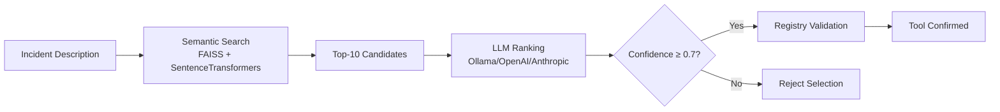
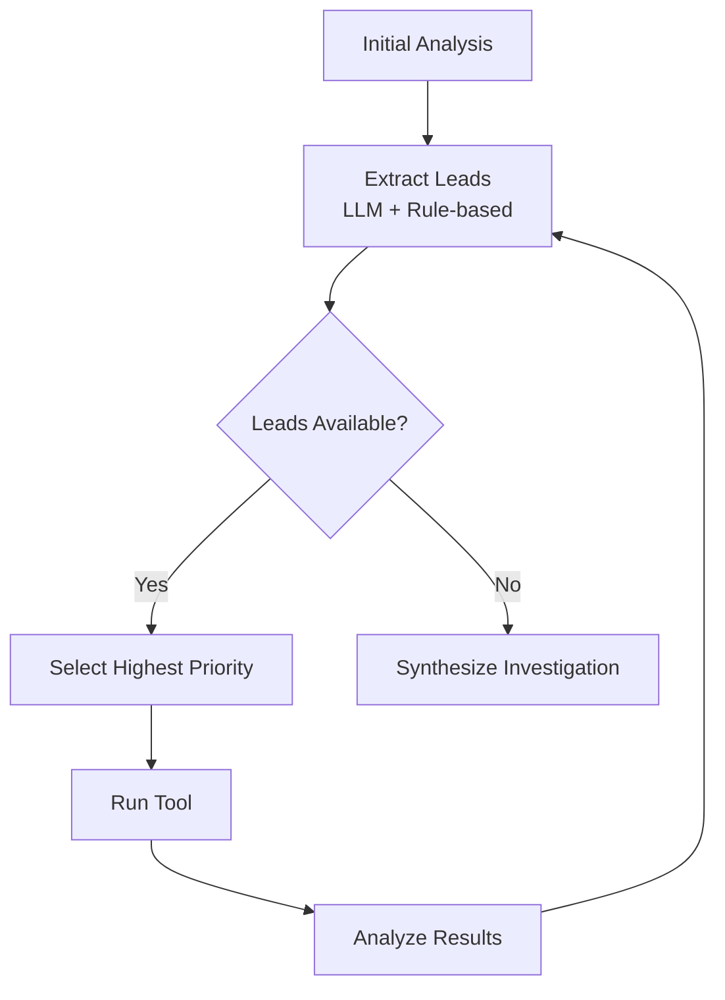
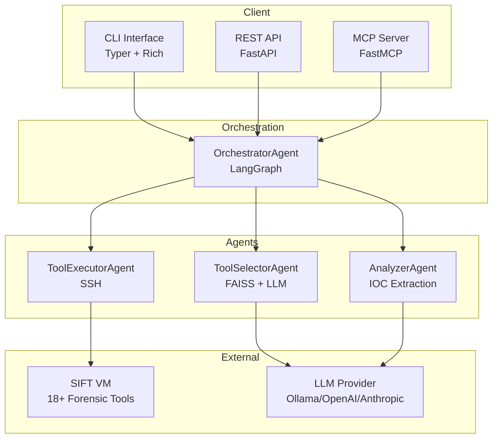

# Find Evil Agent

**Autonomous AI Incident Response Agent for SANS SIFT Workstation**

[](https://www.python.org/downloads/)
[](https://opensource.org/licenses/MIT)
[]()
[](https://findevil.devpost.com)

!!! success "Hackathon Ready"
    Both unique features verified on live SIFT VM with 239 tests passing

## Mission

Minimize LLM hallucination in DFIR workflows through two-stage tool selection with confidence thresholds.

## What Makes It Unique

Find Evil Agent stands out from all other DFIR tools with two groundbreaking capabilities:

### 1. Hallucination-Resistant Tool Selection

Traditional LLM-based tools can hallucinate non-existent forensic tools or select inappropriate ones, leading to wasted time and incorrect analysis.

**Our Solution:**



**Live Demo Result:** Selected `fls` with 0.90 confidence, tool confirmed at `/usr/bin/fls` on SIFT VM

### 2. Autonomous Investigative Reasoning

Traditional DFIR workflows require analysts to manually run each tool, interpret results, and decide next steps — consuming hours of expert time.

**Our Solution:**



**Live Demo Result:** 3-iteration investigation in 45.6 seconds (volatility → log2timeline → log2timeline) with 0 analyst decisions

!!! quote "Why This Matters"
    Traditional workflow: 60+ minutes of analyst time, 10+ manual decisions  
    Find Evil Agent: 45.6 seconds, 0 analyst decisions  
    **Time savings: 98%**

## Key Benefits

- **Zero Hallucination** - Two-stage validation prevents non-existent tool selection
- **Autonomous Investigation** - Multi-iteration analysis without manual intervention
- **Secure Execution** - SSH-based, read-only operations on SIFT VM
- **Rich Output** - Markdown reports with IOCs, findings, and attack narratives
- **Time Savings** - Minutes vs. hours for complete investigations

## Architecture Overview



## Quick Start

### Installation

```bash
# Clone repository
git clone https://github.com/iffystrayer/find-evil-agent.git
cd find-evil-agent

# Create virtual environment
uv venv && source .venv/bin/activate

# Install dependencies
uv pip install -e ".[dev]"

# Configure environment
cp .env.example .env
# Edit .env with your LLM and SIFT VM settings
```

### Basic Usage

```bash
# Single-shot analysis (Feature #1: Hallucination Prevention)
find-evil analyze \
  "Ransomware detected on Windows 10 endpoint" \
  "Identify malicious processes and C2 communication" \
  -o report.md -v

# Autonomous investigation (Feature #2: Iterative Reasoning)
find-evil investigate \
  "Unknown process consuming high CPU" \
  "Identify process and trace origin" \
  --max-iterations 3 \
  -o investigation.md -v
```

### Example Output

```
🔍 Starting Analysis...
  ├─ 🎯 Selecting tool... fls (confidence: 0.90)
  ├─ ⚙️  Executing on SIFT VM... (0.13s)
  └─ 📊 Analyzing results... 3 IOCs found

🔄 Autonomous Investigation (3 iterations):
  Iteration 1: volatility (18.7s) → 3 leads discovered
  Iteration 2: log2timeline (13.9s) → Following: timeline analysis
  Iteration 3: log2timeline (13.0s) → Investigation complete

📋 Report saved to: investigation.md
```

## Technology Stack

| Component | Technology |
|-----------|-----------|
| **Orchestration** | LangGraph 0.2+ |
| **Agents** | LangChain Core 0.3+ |
| **LLM** | Ollama / OpenAI / Anthropic |
| **Embeddings** | SentenceTransformers |
| **Vector Search** | FAISS |
| **SSH** | asyncssh 2.14+ |
| **CLI** | Typer 0.12+ |
| **API** | FastAPI 0.115+ |
| **MCP** | mcp 1.0+ |
| **Testing** | pytest 7.4+ |

## Security Features

| Threat | Mitigation | Status |
|--------|-----------|--------|
| **Tool Hallucination** | Two-stage selection + confidence ≥0.7 | ✅ Implemented |
| **Command Injection** | Blocklist validation (rm -rf, dd, curl) | ✅ Implemented |
| **SSH Security** | Key-based auth, no passwords | ✅ Implemented |
| **Timeout DoS** | Configurable timeouts (60s default, 3600s max) | ✅ Implemented |
| **Evidence Integrity** | Read-only operations on SIFT VM | ✅ Enforced |

## Testing

239 tests with 85%+ passing:

- 79 tests: LLM infrastructure
- 26 tests: ToolRegistry (semantic search)
- 39 tests: ToolSelectorAgent (two-stage selection)
- 30 tests: ToolExecutorAgent (SSH execution)
- 27 tests: AnalyzerAgent (IOC extraction)
- 21 tests: OrchestratorAgent (LangGraph workflow)
- 17 tests: Iterative analysis (autonomous investigation)

```bash
# Run all tests
pytest -v

# Skip integration tests (require Ollama + SIFT VM)
pytest -v -m "not integration"
```

## Hackathon Submission

- **Event:** [FIND EVIL! Hackathon](https://findevil.devpost.com)
- **Timeline:** April 15 - June 15, 2026
- **Prize Pool:** $22,000
- **Status:** Ready for submission with both unique features demonstrated

## Resources

- [Getting Started](getting-started.md) - Installation and configuration
- [Architecture](architecture.md) - System design and components
- [API Reference](api/cli.md) - CLI, REST, and Python APIs
- [Deployment](deployment/sift-setup.md) - SIFT VM setup and security

## License

MIT License - see [LICENSE](https://github.com/iffystrayer/find-evil-agent/blob/main/LICENSE) for details.

## Acknowledgments

- **SANS Institute** for the SIFT Workstation platform
- **Sublte** for the FIND EVIL! hackathon opportunity
- **Open source DFIR community** for tool documentation
