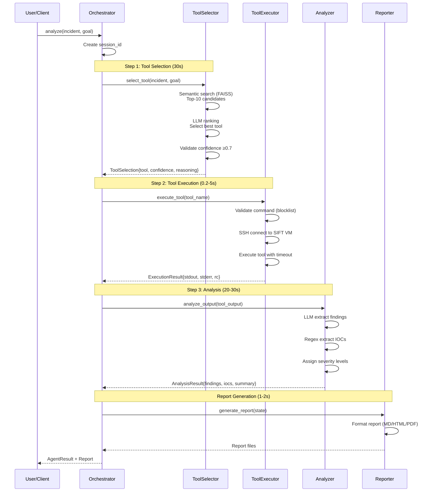
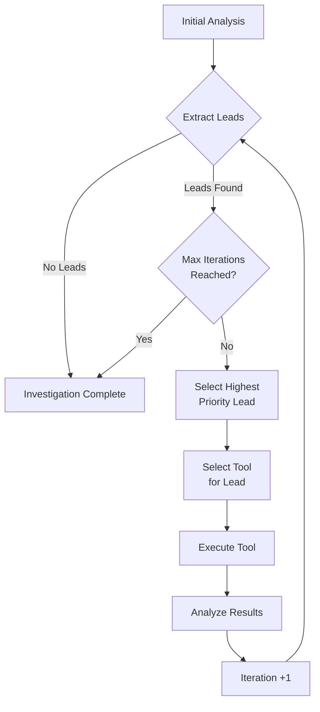
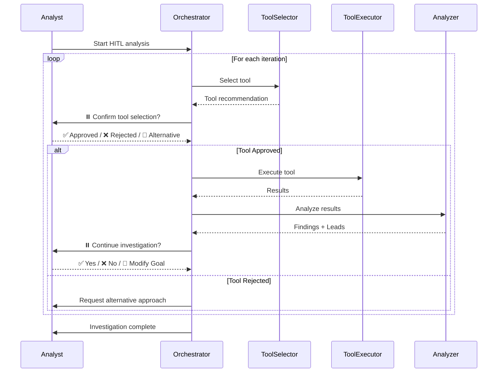
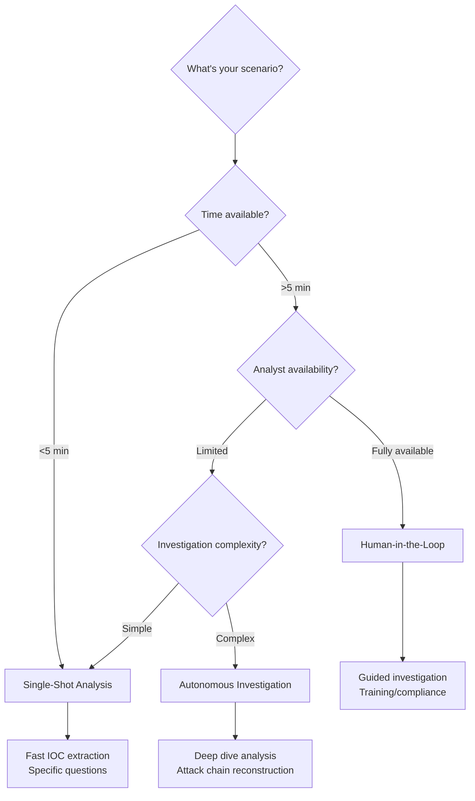

# Workflows

Find Evil Agent supports three primary workflow patterns, each designed for different incident response scenarios.

## Workflow Overview

| Workflow | Use Case | Duration | User Input | Output |
|----------|----------|----------|------------|--------|
| **Single-Shot Analysis** | Quick IOC extraction | 60-90s | Incident + Goal | 1 analysis report |
| **Autonomous Investigation** | Deep dive analysis | 3-15 min | Incident + Goal + Max Iterations | Multi-iteration report |
| **Human-in-the-Loop (HITL)** | Guided investigation | Variable | Incident + Confirmations | Reviewed analysis |

---

## Single-Shot Analysis

**Purpose:** Fast, focused analysis for specific questions about evidence.

**Best For:**

- Quick IOC extraction from logs/memory dumps
- Validating specific hypotheses
- Time-sensitive investigations
- Junior analysts learning DFIR workflows

### Workflow Diagram



### CLI Example

```bash
# Basic analysis
find-evil analyze \
  "Suspicious PowerShell execution detected in logs" \
  "Extract command-line arguments and identify malicious scripts"

# With options
find-evil analyze \
  "Unknown process consuming high CPU on endpoint-042" \
  "Identify process name, PID, and parent process" \
  --output analysis.html \
  --verbose \
  --provider ollama \
  --model gemma2:27b
```

### API Example

```bash
curl -X POST http://localhost:18000/api/v1/analyze \
  -H "Content-Type: application/json" \
  -d '{
    "incident_description": "Ransomware encryption on file server",
    "analysis_goal": "Identify encryption mechanism and patient zero",
    "llm_provider": "anthropic",
    "llm_model": "claude-sonnet-4.5"
  }'
```

### Expected Output

```
🔍 Find Evil Agent - Analysis Report

Session ID: 3f8a9c2d-1b4e-4f9a-8c3d-7e6f5a4b3c2d
Timestamp: 2026-05-08 21:45:32 UTC

━━━━━━━━━━━━━━━━━━━━━━━━━━━━━━━━━━━━━━━━━━━━━
 TOOL SELECTION
━━━━━━━━━━━━━━━━━━━━━━━━━━━━━━━━━━━━━━━━━━━━━

Selected Tool: volatility
Confidence: 0.92 (92%)
Reasoning: Memory analysis best suited for ransomware process detection
Alternatives: strings (0.81), foremost (0.73)
Execution Time: 1.23s

━━━━━━━━━━━━━━━━━━━━━━━━━━━━━━━━━━━━━━━━━━━━━
 EXECUTION RESULTS
━━━━━━━━━━━━━━━━━━━━━━━━━━━━━━━━━━━━━━━━━━━━━

Command: volatility -f /evidence/memdump.raw --profile=Win10x64 pslist
Exit Code: 0
Duration: 4.56s
Output: 428 lines

━━━━━━━━━━━━━━━━━━━━━━━━━━━━━━━━━━━━━━━━━━━━━
 FINDINGS (3)
━━━━━━━━━━━━━━━━━━━━━━━━━━━━━━━━━━━━━━━━━━━━━

[CRITICAL] Malicious Process Detected
  Process "ransomware.exe" (PID 4852) with no parent process
  
[HIGH] Suspicious Network Connection
  Connection to 203.0.113.42:8443 (C2 infrastructure)
  
[MEDIUM] Encrypted File Extension Pattern
  Multiple .encrypted extensions detected in file system

━━━━━━━━━━━━━━━━━━━━━━━━━━━━━━━━━━━━━━━━━━━━━
 INDICATORS OF COMPROMISE
━━━━━━━━━━━━━━━━━━━━━━━━━━━━━━━━━━━━━━━━━━━━━

IP Addresses (2):
  • 203.0.113.42
  • 198.51.100.17

File Paths (1):
  • C:\Windows\Temp\ransomware.exe

Hashes (MD5) (1):
  • 5d41402abc4b2a76b9719d911017c592

Report saved to: analysis.html (28.4 KB)
```

### Performance

- **Total Duration:** 60-90 seconds
- **LLM Calls:** 2 (tool selection + analysis)
- **SSH Connections:** 1
- **Network Transfer:** Minimal (<1 MB)

---

## Autonomous Investigation

**Purpose:** Deep, multi-iteration analysis that follows investigative leads automatically.

**Best For:**

- Complex incidents requiring correlation across multiple tools
- Root cause analysis
- Attack chain reconstruction
- Autonomous triage of large evidence sets

### How It Works



### Lead Extraction

The AnalyzerAgent automatically extracts investigative leads from findings:

**Example Finding:**
> "Suspicious PowerShell process (PID 3842) executed encoded command"

**Extracted Leads:**

1. **Priority:** HIGH  
   **Lead:** "Analyze memory dump for PowerShell process 3842"  
   **Suggested Tool:** volatility

2. **Priority:** MEDIUM  
   **Lead:** "Decode and analyze PowerShell command content"  
   **Suggested Tool:** strings

3. **Priority:** LOW  
   **Lead:** "Check parent process of PID 3842"  
   **Suggested Tool:** volatility

### CLI Example

```bash
# Autonomous investigation with 5 iterations
find-evil investigate \
  "Multiple failed login attempts followed by successful RDP connection" \
  "Trace the attack path from initial access to lateral movement" \
  --max-iterations 5 \
  --output investigation.html \
  --verbose

# Quick 2-iteration investigation
find-evil investigate \
  "Unknown binary executed from temp directory" \
  "Identify malware family and persistence mechanism" \
  --max-iterations 2 \
  --output quick-check.md
```

### API Example

```bash
curl -X POST http://localhost:18000/api/v1/investigate \
  -H "Content-Type: application/json" \
  -d '{
    "incident_description": "Data exfiltration suspected via DNS tunneling",
    "analysis_goal": "Identify exfiltration method and compromised data",
    "max_iterations": 5,
    "llm_provider": "openai",
    "llm_model": "gpt-4"
  }'
```

### Expected Output

```
🔬 Find Evil Agent - Autonomous Investigation

Session ID: 7c9b2f1a-4e8d-4a9c-b3f2-8e7d6c5b4a3c
Timestamp: 2026-05-08 22:15:47 UTC
Max Iterations: 5

━━━━━━━━━━━━━━━━━━━━━━━━━━━━━━━━━━━━━━━━━━━━━
 ITERATION 1 - Initial Analysis
━━━━━━━━━━━━━━━━━━━━━━━━━━━━━━━━━━━━━━━━━━━━━

Tool: volatility (confidence: 0.91)
Duration: 18.7s
Findings: 4
Leads Extracted: 3

[CRITICAL] Malicious PowerShell Process
  PID 3842 executed encoded command at 2026-05-08 14:32:15
  
Lead Extracted: "Decode PowerShell command from PID 3842"

━━━━━━━━━━━━━━━━━━━━━━━━━━━━━━━━━━━━━━━━━━━━━
 ITERATION 2 - Following Lead: Decode PowerShell
━━━━━━━━━━━━━━━━━━━━━━━━━━━━━━━━━━━━━━━━━━━━━

Tool: strings (confidence: 0.87)
Duration: 2.3s
Findings: 2
Leads Extracted: 2

[HIGH] Base64 Encoded Command Decoded
  Command downloads payload from 203.0.113.42/payload.exe
  
Lead Extracted: "Analyze network traffic to 203.0.113.42"

━━━━━━━━━━━━━━━━━━━━━━━━━━━━━━━━━━━━━━━━━━━━━
 ITERATION 3 - Following Lead: Network Traffic
━━━━━━━━━━━━━━━━━━━━━━━━━━━━━━━━━━━━━━━━━━━━━

Tool: tcpdump (confidence: 0.93)
Duration: 5.1s
Findings: 3
Leads Extracted: 1

[CRITICAL] C2 Communication Detected
  HTTPS traffic to 203.0.113.42:443 (likely C2 server)
  Data exfiltration: 147 MB transferred
  
Lead Extracted: "Analyze TLS certificates for C2 infrastructure"

━━━━━━━━━━━━━━━━━━━━━━━━━━━━━━━━━━━━━━━━━━━━━
 ITERATION 4 - Following Lead: TLS Certificates
━━━━━━━━━━━━━━━━━━━━━━━━━━━━━━━━━━━━━━━━━━━━━

Tool: wireshark (confidence: 0.89)
Duration: 8.4s
Findings: 2
Leads Extracted: 0

[HIGH] Self-Signed Certificate Detected
  CN=evil-c2.net, issued 2026-05-01
  
No further leads extracted.

━━━━━━━━━━━━━━━━━━━━━━━━━━━━━━━━━━━━━━━━━━━━━
 INVESTIGATION SUMMARY
━━━━━━━━━━━━━━━━━━━━━━━━━━━━━━━━━━━━━━━━━━━━━

Total Iterations: 4 (stopped early - no more leads)
Total Duration: 34.5s
Tools Used: volatility → strings → tcpdump → wireshark
Total Findings: 11 (3 CRITICAL, 4 HIGH, 3 MEDIUM, 1 LOW)

ATTACK CHAIN RECONSTRUCTED:
1. PowerShell encoded command execution (PID 3842)
2. Payload download from 203.0.113.42/payload.exe
3. C2 communication established to 203.0.113.42:443
4. Data exfiltration (147 MB via HTTPS)

Report saved to: investigation.html (142.8 KB)
```

### Iteration Limits

- **Minimum:** 2 iterations
- **Default:** 3 iterations
- **Maximum:** 10 iterations
- **Early Stop:** Investigation ends if no leads extracted

### Performance

- **Duration per Iteration:** 10-60 seconds (depends on tool)
- **Total Duration:** 1-15 minutes
- **LLM Calls:** 2 per iteration (tool selection + analysis)

---

## Human-in-the-Loop (HITL)

**Purpose:** Guided investigation with analyst confirmation at each step.

**Best For:**

- High-stakes investigations requiring human oversight
- Training junior analysts
- Compliance scenarios requiring approval trails
- Exploratory analysis with uncertain direction

### Workflow Diagram



### Web UI Example

The React and Gradio web interfaces support HITL mode natively:

1. **Enable HITL Mode:** Toggle "Human-in-the-Loop" checkbox
2. **Start Analysis:** Provide incident description and goal
3. **Tool Selection Pause:** Review recommended tool, confidence, reasoning
4. **Confirm/Reject:** Click "Execute Tool" or "Try Different Tool"
5. **Review Results:** Examine findings and extracted leads
6. **Continue/Stop:** Choose to follow a lead or end investigation

### API Example

```python
import requests

session = requests.post(
    "http://localhost:18000/api/v1/investigate/hitl",
    json={
        "incident_description": "Suspected lateral movement via SMB",
        "analysis_goal": "Trace attacker path across network",
        "max_iterations": 5
    }
)

session_id = session.json()["session_id"]

# Poll for confirmation requests
while True:
    status = requests.get(f"/api/v1/sessions/{session_id}/status")
    
    if status.json()["state"] == "awaiting_confirmation":
        tool_selection = status.json()["pending_selection"]
        
        # Present to analyst
        print(f"Recommended: {tool_selection['tool_name']}")
        print(f"Confidence: {tool_selection['confidence']}")
        print(f"Reasoning: {tool_selection['reasoning']}")
        
        # Get analyst decision
        approved = input("Approve? (y/n): ") == "y"
        
        # Send confirmation
        requests.post(
            f"/api/v1/sessions/{session_id}/confirm",
            json={"approved": approved}
        )
    elif status.json()["state"] == "completed":
        break
```

### Confirmation Points

1. **Tool Selection** - Before executing each tool
2. **Iteration Continue** - Before following extracted lead
3. **Direction Change** - After unexpected findings
4. **Investigation End** - Manual stop at any point

### Benefits

- **Audit Trail:** All approvals/rejections logged
- **Learning:** Analysts see reasoning for each tool selection
- **Control:** Human oversight prevents runaway investigations
- **Flexibility:** Change direction based on findings

---

## Workflow Comparison

### Decision Matrix



### Feature Comparison

| Feature | Single-Shot | Autonomous | HITL |
|---------|-------------|------------|------|
| **Duration** | 60-90s | 3-15 min | Variable |
| **Iterations** | 1 | 2-10 | 1+ |
| **User Input** | Initial only | Initial only | Per iteration |
| **Lead Extraction** | No | Yes | Yes |
| **Audit Trail** | Basic | Detailed | Comprehensive |
| **Best For** | Speed | Depth | Oversight |

### Use Case Examples

#### Single-Shot Analysis

- ✅ "What processes are running in this memory dump?"
- ✅ "Extract IP addresses from this PCAP file"
- ✅ "Check if this binary is packed or obfuscated"

#### Autonomous Investigation

- ✅ "Trace the attack path from initial access to data exfiltration"
- ✅ "Identify all indicators of this ransomware campaign"
- ✅ "Reconstruct the timeline of this insider threat incident"

#### Human-in-the-Loop

- ✅ "Investigate this APT intrusion with legal team oversight"
- ✅ "Train junior analyst on DFIR workflow"
- ✅ "Explore unknown malware family with controlled tool execution"

---

## Advanced Workflow Patterns

### Hybrid Workflows

Combine workflow types for complex scenarios:

```bash
# Phase 1: Quick triage (Single-Shot)
find-evil analyze \
  "Multiple endpoints offline after suspicious email" \
  "Quick IOC extraction from email headers"

# Phase 2: Deep dive (Autonomous)
find-evil investigate \
  "Ransomware deployment detected - IOCs from Phase 1" \
  "Reconstruct full attack chain" \
  --max-iterations 8

# Phase 3: Validation (HITL)
# Use web UI to confirm findings with IR team
```

### Batch Processing

Process multiple evidence sources:

```bash
#!/bin/bash
# analyze_evidence_batch.sh

for evidence in /evidence/*.raw; do
  find-evil analyze \
    "Memory dump from endpoint: $(basename $evidence)" \
    "Extract processes, network connections, and IOCs" \
    --output "reports/$(basename $evidence .raw).html"
done
```

### Integration with SOAR

Trigger Find Evil Agent from Security Orchestration platforms:

```python
# SOAR playbook example
def investigate_alert(alert):
    response = requests.post(
        "http://find-evil-api:18000/api/v1/investigate",
        json={
            "incident_description": alert["description"],
            "analysis_goal": "Identify if this is a true positive",
            "max_iterations": 3
        }
    )
    
    if response.json()["severity"] in ["CRITICAL", "HIGH"]:
        escalate_to_ir_team(response.json())
    else:
        mark_as_false_positive(alert)
```

---

## Workflow Best Practices

### 1. Start Broad, Then Focus

```bash
# ✅ Good: Broad initial analysis
find-evil analyze \
  "Suspicious activity on endpoint-042" \
  "Identify any unusual processes or network connections"

# ❌ Too specific: May miss context
find-evil analyze \
  "PID 3842 on endpoint-042" \
  "Check if this specific process is malicious"
```

### 2. Set Appropriate Iteration Limits

```bash
# ✅ Good: Reasonable limit for time-sensitive triage
find-evil investigate \
  "Ransomware deployment in progress" \
  "Identify patient zero and scope" \
  --max-iterations 3

# ❌ Too high: May waste resources
find-evil investigate \
  "Minor anomaly detected" \
  "Investigate root cause" \
  --max-iterations 10
```

### 3. Use HITL for High-Stakes Scenarios

```bash
# ✅ Good: HITL for legal hold scenario
# Use web UI with HITL mode enabled

# ❌ Risky: Autonomous for sensitive investigation
find-evil investigate \
  "CEO laptop suspected compromise" \
  "Extract all activity" \
  --max-iterations 10  # No oversight!
```

### 4. Save Intermediate Results

```bash
# ✅ Good: Save results at each stage
find-evil investigate \
  "Multi-stage attack detected" \
  "Reconstruct attack chain" \
  --max-iterations 5 \
  --output investigation.html  # Report saved automatically

# Also available: Session state in .vfs/sessions/{session_id}/
```

---

## Performance Tuning

### Optimize LLM Selection

```bash
# Fast but less accurate (good for triage)
find-evil analyze ... \
  --provider ollama \
  --model gemma2:9b

# Slower but more accurate (good for deep analysis)
find-evil analyze ... \
  --provider anthropic \
  --model claude-sonnet-4.5
```

### Parallel Execution (Future)

```python
# Not yet implemented - roadmap item
# Will allow parallel tool execution when independent

from find_evil_agent import ParallelOrchestrator

result = ParallelOrchestrator().investigate(
    incident="Multi-vector attack",
    goal="Analyze all attack vectors simultaneously",
    parallel_tools=["volatility", "tcpdump", "log2timeline"]
)
```

---

## Next Steps

- [Components](components.md) - Deep dive into each component
- [Examples](examples.md) - Real-world workflow examples
- [API Reference](api/cli.md) - Complete API documentation
- [Troubleshooting](troubleshooting.md) - Common workflow issues
